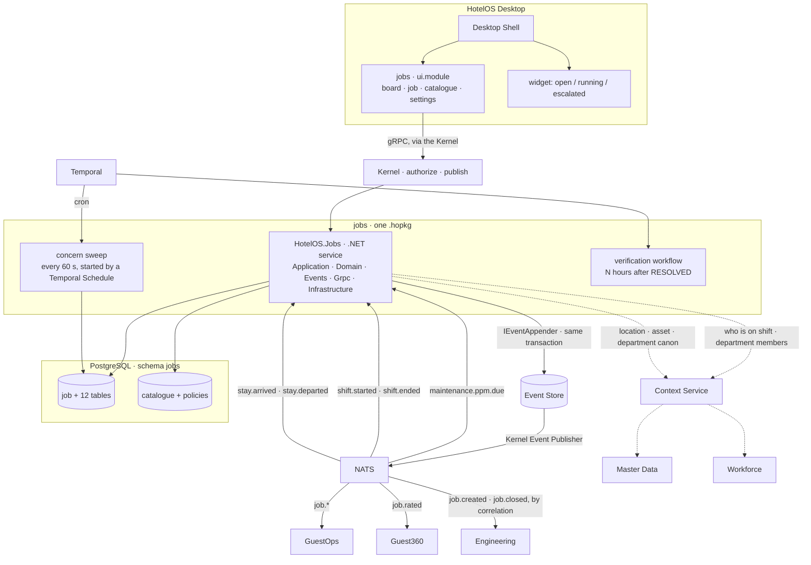

# 03 · The Jobs design — how we implement what the walkthrough locked

> **Design of record**, with `02-the-jobs-walkthrough-and-sign-off.md`
> (architect ruling 1, 2026-09-03). Every section cites the walkthrough
> decision or the ruling it implements. Where a line depends on a ruling not
> yet given, it says so and stops there.

---

## 0 · What this page is for

The walkthrough is the *what*, in the owner's language, locked on
2026-09-03 after ten sections and ninety-odd decisions. This page is the
*how*: the tables, the events, the permissions, the manifest, the sweep, the
screens — and, as the Oracle connector's page did, **for each thing that
went wrong in the reference, what here means it cannot go wrong the same
way**, graded honestly:

```text
INEXPRESSIBLE   the mechanism means the defect cannot be written down
REFUSED         it can be written, and the platform rejects it with a diagnostic
NO OCCASION     the structure removes the situation; a determined author could still err
```

Nothing on this page is a decision. Where the walkthrough ruled, this page
implements; where it parked, this page proposes and marks it.

---

## 1 · The architecture

One installable package, `kind: dotnet-service`, one schema, one event
domain, one signed `ui.module`. Every box is named as the platform names it.



Four lines of it are rules, not drawing:

* **Jobs appends its events in its own transaction** through the SDK's
  `IEventAppender`, exactly as Workforce's `PostingAnnouncer` does — the
  event and its `publish_state` row commit with the change or neither does.
  The v3 diagram's older comment (*"a .hopkg has no database role, so the
  Kernel appends on its behalf"*) predates ADR 0103's addendum giving an
  installed application its own schema and credential; §9 reports the
  wording for reconciliation rather than building to it.
* **Jobs calls no other application.** Every cross-application fact is an
  event in (`maintenance.ppm.due`, `shift.started`) or an event out
  (`job.created` with the correlation id the raiser sent — `EVT-Q3`). Every
  cross-application *question* goes to Context.
* **Jobs holds no per-job timers.** One Temporal Schedule wakes the sweep, and
  the sweep compares timestamps already on the rows (walkthrough S5-D12) — a
  timer per job is the rebuild-on-every-edit trap the platform's own boundary
  test names.
* **Jobs writes no authorization tuple.** It declares one grant kind in its
  manifest and publishes the two events; the Kernel materialises
  `property#jobs_manager` (AUTHZ-Q25; ruling 4).

---

## 2 · The schema — `jobs`

One schema, owned by the package, migrated by its own `migrate` verb (ADR
0103 addendum). Every table carries `property_id` — the one scope column
(walkthrough S1-D8) — except the organization-scoped catalogue (ruling 3).
Every id is a UUIDv7 generated by the application (`Uuid7.NewUuid7()`, the
platform's own). Every "who" is `{ kind, id }` — `actor_kind` ·
`actor_id` — never a name (S1-D17). Logical removal, where a table has it,
is `deleted_at · deleted_by` and nothing else (ruling 6).

### 2.1 · `job` — the aggregate, 23 columns

| Column | Type | Rule |
|---|---|---|
| `job_id` | uuid PK | never shown |
| `job_number` | text, unique per property | `KOC-ENG-441`; stamped from `property_job_sequence` at creation, never recomputed (S1-D3) |
| `property_id` | uuid | RLS-backed, as every operational row |
| `category_id` · `item_id` | uuid → catalogue | what it is about (S1-D6, ruling 3) |
| `location_id` | uuid → `masterdata.locations` | required; any node of the one tree (S1-D1) |
| `asset_id` | uuid → `masterdata.assets`, null | auto-attached when the location holds exactly one asset of the item's `applies_to` type |
| `department_code` | text → canon | from the item; changeable by *manage*; the number does not change |
| `summary` | text | one line |
| `details` | text, null | |
| `priority` | enum | `EMERGENCY · HIGH · NORMAL · LOW · NOT_TRIAGED` |
| `priority_decided_by` | enum | `MANUAL · FLOW · CATALOGUE · NONE` (S1-D4) |
| `raised_via` | enum | `APP · QR · GUEST_APP · WHATSAPP` |
| `raised_kind` | enum | `STAFF · GUEST · APPLICATION` |
| `raised_by_id` | text | user id · Guest360 id · application id |
| `stay_id` | uuid, null | **NOT NULL when `raised_kind = GUEST`** — a CHECK |
| `restricted` | bool | S9-D4; defaulted from the item's `restricted_by_default` |
| `scheduled_for` | timestamptz, null | the raiser's choice; future ⇒ `SCHEDULED` |
| `due_at` | timestamptz, null | set when the clock starts; movable by *manage* |
| `job_status` | enum | `SCHEDULED · RAISED · ASSIGNED · ACCEPTED · IN_PROGRESS · ON_HOLD · RESOLVED · CLOSED · CANCELLED` |
| `hold_reason` · `hold_until` | text, timestamptz; null | only while `ON_HOLD` (S6-D2) |
| `cycle` | int | 1; +1 per reopen |
| `created_by` · `created_at` · `updated_by` · `updated_at` · `version` | the platform's five | `version` is the optimistic-concurrency guard and the event's `entity_version` |
| `deleted_at` · `deleted_by` · `delete_reason` | soft delete | *administer* only; reason required |

**Not on the table, by ruling:** `glitch`, `live_at`, `resume_at`,
`next_check_at`, `origin_app/ref`, a `created_by` actor, an `active` flag —
each proposed and withdrawn on 2026-09-03; the walkthrough records why.

### 2.2 · The twelve beside it — one fact each

| Table | Row per | Columns |
|---|---|---|
| `job_assignment` | each hand-over | `assigned_to_user_id` **xor** `assigned_to_team_id` · `assigned_by_{kind,id}` · `assigned_at` · `ended_at` · `end_reason` `REASSIGNED · HANDED_BACK · ACCEPTED_BY_MEMBER · RESOLVED` · `mode` `MANUAL · AUTO · INHERITED` — **current = the row with `ended_at IS NULL`** (S3) |
| `job_status_history` | each transition | `from_status` · `to_status` · `changed_by_{kind,id}` · `at` · `reason` |
| `job_work_session` | each stretch of one person's work | `user_id` · `started_at` · `ended_at` (null = running) · `end_reason` `PAUSE · STOP · REASSIGNED · AUTO_STOPPED` · `minutes` (S1-D10) |
| `job_resolution` | each cycle's closing | `cycle` · `resolution_id` → catalogue · `note` · `resolved_by_user_id` · `resolved_at` · `closed_by_user_id` · `closed_at` |
| `job_note` | each comment | `by_{kind,id}` · `text` · `mentions uuid[]` · `at` |
| `job_attachment` | each photo | `media_id` → `masterdata.media` · `stage` `RAISED · RESOLVED` · `by_{kind,id}` · `at` |
| `job_link` | each relation | `related_job_id` · `relation` `GROUP · PARENT` · `step` (parent only) · `linked_by_{kind,id}` (S1-D2) |
| `job_concern_history` | each concern change | `at` · `from_concern` · `to_concern` · `reason` · `accountable_role` · `accountable_user_id` (S5) |
| `job_nudge` | each watcher's last nudge | `role` · `user_id` · `last_nudged_at` (S5 repeats) |
| `job_reminder` | each manual reminder | `remind_at` · `note` · `for_user_id` **xor** `for_role` · `created_by_user_id` · `fired_at` (S6-D3) |
| `job_rating` | one per guest-raised job | `stay_id` · `stars 1–5` · `comment` · `rated_at` — CHECK: only when `raised_kind = GUEST` and status `CLOSED` (S8-D2) |
| `property_job_sequence` | one per property | `last_number` — incremented in the creating transaction (S1-D3) |

**Not built, by ruling:** `job_escalation` (replaced by the concern
history), `job_recovery` (dropped with `glitch`), `job_watcher` (S7 has a
fixed table, no followers), a `teams` table (Workforce's — S3-D1).

### 2.3 · The catalogue — Jobs' own, organization-scoped (ruling 3)

| Table | Scope | Columns |
|---|---|---|
| `category` | organization | `code` · `name jsonb` (per language) · `department_code` · `icon` · `active` · `deleted_at/by` |
| `item` | organization | `category_id` · `code` · `name jsonb` · `guest_requestable` · `applies_to` `ROOM · PUBLIC_AREA · ASSET_TYPE:<type>` · `needs_checklist` · `photo_on_completion` `NONE · OPTIONAL · REQUIRED` · `typical_minutes` · `restricted_by_default` · `active` · `deleted_at/by` |
| `item_alias` | organization | `item_id` · `alias` · `language` — search only, never routing |
| `resolution` | organization | `category_id` null = universal · `item_id` null = every item of the category · `name jsonb` · `note_required` (true for *other*) |
| `property_item_policy` | **property** | `item_id` · `active_here` · `display_name jsonb` · `default_priority` · `standard_minutes` · `concern_policy_id` · `auto_assign` `USER · TEAM` · `auto_assign_team_id` · `chargeable` · `price` — *what we promise here* |
| `concern_policy` | property | `name` · per state: `at_risk_pct` · `not_accepted_min` · `not_started_min` · `overload_open_jobs` · `stuck_min` · `accountable_at_risk` · `accountable_breached` · `accountable_stuck` (roles) (S5-D3) |
| `concern_subscription` | property | `role` · `concern` · `department_code` null = all · `repeat_min` (S5) |
| `service_hours` | property | `department_code` null = the property · `from` · `to` (S5-D8) |
| `department_presence` | property | `department_code` · `staffed` · `since` · `next_shift_at` (fallback) — kept by `shift.started/ended` (S5-D13) |

**Policy resolution** for a job: `property_item_policy` for the item → the
category's default → the department's → the property's; the resolved
`concern_policy_id` is stamped on `job_concern_history`'s first row so a
later edit never rewrites this job's past.

The same chain carries **due time**, and it is why one department can keep
different promises: Housekeeping › *Cleaning* 30 minutes, Housekeeping ›
*Bottle of water* 10 minutes, and *Deep clean* 90 — the item's own
`standard_minutes` first, else the category's, else the department's row
of `concern_policy`, else the property's. A category may carry its own
`concern_policy_id` for the same reason (owner's question, 2026-09-04).

**Timestamps** everywhere are stored UTC and shown as date *and* time, in
the property's zone. **Ruled by the architect, 2026-09-04** (after the
owner's correction that no document named an hour format): the host hands
a module `locale` + `timezone` (Z is adding them to what the host passes);
**the formatting utility lives in `@hotelos/sdk`**, the shared home every
app's UI already imports, deriving date order and hour cycle from those two;
**Jobs builds it, as the first screen that renders a timestamp**, and
GuestOps, Workforce and every later app import it rather than writing their
own. Jobs configures none of it (owner, 2026-09-04).

**Who else reads it.** GuestOps and Room Care raise jobs against catalogue
items, and they read the catalogue the way every cross-application question
is answered on this platform: **through Context**, never a copy and never a
call into Jobs. Jobs answers Context's catalogue queries (`category`, `item`,
`item_alias`, `property_item_policy.active_here`) for the property; a
consumer holds the `category_id` / `item_id` it was shown and nothing else.
Without Jobs installed there is no catalogue to show, and the consumer's
own record stands alone until Jobs arrives and replays it (JOBS-Q1 (5)).
Owner confirmation 2026-09-04, after the register entry was re-read: the
catalogue stays Jobs' own; the earlier "keep it in Core" reading in the
walkthrough's S1-D6 is withdrawn.

---

## 3 · Events — domain `job`

Every state change appends an event in the same transaction as the row
(constitution §"Events are appended in the caller's transaction"). The
aggregate is the **job**; `entity_version` is the job's `version`, bumped in
the same transaction — a consumer that sees a gap calls `ReplayAggregate`
(Chapter 21). Payloads are typed records serialised `SnakeCaseLower` by the
SDK's `EventAppender`, with `[JsonPropertyName]` on every member and a
wire-shape test asserting the literal strings — the two defects `EVT-Q4` and
`AUTHZ-Q20` record are why.

### 3.1 · Published

| Event | When | Carries, beyond the envelope |
|---|---|---|
| `job.created` | the row commits | `job_id · job_number · property_id · category_id · item_id · location_id · asset_id · department_code · priority · raised_via · raised_kind · raised_by_id · stay_id · scheduled_for · restricted` and **`correlation_id` — the raiser's, echoed** (`EVT-Q3`) |
| `job.assigned` | an assignment row opens | `assigned_to_user_id` xor `assigned_to_team_id` · `mode` · previous assignee |
| `job.accepted` | ASSIGNED → ACCEPTED | `user_id` |
| `job.started` | the first session opens | `user_id` |
| `job.held` · `job.resumed` | ON_HOLD in and out | `hold_reason · hold_until` / the state returned to |
| `job.resolved` | RESOLVED | `cycle · resolution_id · note · resolved_by_user_id · asset_id` |
| `job.closed` | CLOSED | `cycle · closed_by_user_id` and **`correlation_id`** — Engineering closes P-77 on it (S1-D12) |
| `job.cancelled` | CANCELLED | `reason · by` |
| `job.reopened` | CLOSED → RAISED | `cycle` |
| `job.concern_changed` | a concern-history row | `from · to · reason · accountable_role · accountable_user_id` (S5) |
| `job.rated` | a rating lands | `stay_id · stars · comment` — Guest360 consumes (S8-D2) |
| `user.jobs_manager_granted` · `user.jobs_manager_revoked` | the GM's action | domain `user`, aggregate `property`; the Kernel folds them into `property#jobs_manager` (§4, ruling 4) |

**The reply is an event.** Room Care, Engineering or GuestOps raise a job by
publishing into their own domain with a `correlation_id`; Jobs consumes,
creates, and `job.created` carries that id back. Nobody calls Jobs and
waits — `EVT-Q3`, the owner ruling of 2026-08-31, which the constitution now
cites at the site (ruling 2).

### 3.2 · Subscribed — declared in the manifest, validated at install (`EVT-Q4`)

| Subject | Why |
|---|---|
| `maintenance.ppm.due` | Engineering's occurrence became due → an ordinary job, `raised_kind APPLICATION`, `raised_via APP` (S1-D12, S10) |
| `shift.started` · `shift.ended` | Workforce's Temporal-scheduled fan-out → `department_presence` (S5-D13). *Requested of Workforce; until it exists the presence row keeps the roster fallback* |
| `stay.departed` | a guest-raised job for a stay that has left: the clock stops, the supervisor is told (the guest is gone; the promise is void) |
| `staff.exited` | an assignee who has left the organization: the assignment ends `REASSIGNED`, the job returns to the pool |
| `guestops.request.raised` *(name GuestOps')* | **ruling 5 — Deferred + Replay**: a guest request GuestOps recorded while Jobs was not installed is its own record; an installing Jobs declares this subscription and **replays the backlog** on first start, creating the jobs it missed. No pretended screen on either side |

One durable consumer per stream, named `jobs-{stream}`, ack after commit,
idempotent on `event_id`, `DeliverPolicy: New` with the store as the archive
— the `54b` contract as ratified, unchanged.

---

## 4 · Permissions and the one grant kind

### 4.1 · Permissions — eight concrete verbs (architect, ruled 2026-09-04)

> **Architect's correction, 2026-09-04:** *manage* and *administer* are the
> generic-verb class the permission registry's parser refuses — the
> platform already paid for it when `integration.manage` could not be
> registered and became `integration.configure`. Three rules: (1) concrete
> verbs naming the operation the screen gates, in the registry's live
> `domain.verb` idiom; (2) tiers are FGA relations, not permissions; (3) a
> name changes when the capability changes, never the implementation.
>
> **Ruled the same day, one pass, both flagged splits taken:** eight rows.
> `job.cancel` is split out — *"a terminal outcome with a reason is
> complete's sibling rather than a course change, and a supervisor who may
> reschedule but not cancel is a policy the vocabulary must be able to
> express (folded in, it becomes inexpressible forever)"*. `job.curate` is
> split from `job.configure` — *"two scopes are two administrative
> decisions, and a property manager configuring their ladders must not
> thereby edit the group's catalogue."*

`infrastructure/openfga/permissions.yaml` already declares the first four
(and `job.approve_cost`); the census of its live verbs (read 20 · create 15
· update 14 · configure 8 · assign 4 · amend 2) is the idiom matched.

| Permission | Exists | The operation it gates | Screen |
|---|---|---|---|
| `job.read` | yes · `job#viewer` | open the board and a job in my department, my own jobs anywhere | 1, 2–2g, 5, 6 |
| `job.create` | yes · `job#can_create` | raise a job — now, or for a day (`scheduled_for`) | 3 |
| `job.assign` | yes · `job#can_assign` | assign or reassign a job to a person or a team; accept AUTO's pick | 2 Reassign, 3 Assign to |
| `job.complete` | yes · `job#can_close` | resolve a job with a resolution, close it, reopen inside the window | 4 |
| `job.cancel` | **new** · `job#can_cancel` | end a job as CANCELLED with a reason; cascades to its steps | 2 More ▾ › Cancel |
| `job.amend` | **new** · `job#can_amend` | change a job's course: hold and resume, reschedule, re-prioritise, restrict / unrestrict, link, add a step | 2 More ▾, hold, priority |
| `job.configure` | **new** · `property#jobs_configurer` | this property's concern policies and ladders, presence and service hours, who is told, holds, closing and rating rules, item activation and overrides | page 02 |
| `job.curate` | **new** · `organization#can_curate_jobs` | the organisation's catalogue: categories, items, aliases, resolutions | page 01 frame 7 |

Registered and **not requested**: `job.approve_cost` — the name survives,
the capability is not claimed; no cost exists on a job in this design (§7).

**The work-session verbs** — accept, start, pause, resume, stop — are not
permissions. They are the assignee's acts on their own job and ride on the
`job#assignee` relation; an assignee acting on their own job needs no grant.
A supervisor stopping someone else's session is `job.assign` (a
reassignment) or `job.amend` (a hold), never a ninth verb.

**Tiers dissolve into relations** (`model.fga`, §4.2): *execute* is
`viewer or assignee`; *manage* is `supervisor from department`; *everything,
anyone's* is `jobs_manager from property`, named with `or jobs_manager from
property` across the job set. No permission is called a tier.

The manifest (§5) requests the eight.

### 4.2 · The grant kind — `property#jobs_manager` (S9-D7, ruling 4)

Declared in the manifest exactly as Workforce declares `department#posted`
(AUTHZ-Q25's mechanism): the package declares, the Kernel materialises at
install from the manifest it stores, the grantable-relations registry
structures which relations may be named, and **the install consent screen
renders it** — *"this application will grant property-wide job management
when a general manager assigns it."*

```yaml
authorization:
  grants:
    - domain: user
      aggregate: property
      granted: jobs_manager_granted
      revoked: jobs_manager_revoked
      ends: both_in_body
      body_object: property
      relation: jobs_manager
```

`model.fga` gains, on `type property`, `define jobs_manager: [user]` and
`define jobs_configurer: general_manager or jobs_manager`; on
`type organization`, `define can_curate_jobs: [user]` (the org admin);
on `type job`, `can_cancel: supervisor from department` and
`can_amend: supervisor from department` are added, and every `can_*` on
`type job` gains `or jobs_manager from property`.
**The registry entry is the architect's** (ruling 4 confirms the route; the
row itself is written there, not here). Jobs never writes the tuple.

> **Amended 2026-09-05 — CC's transcription, register row `daf4294`.** This
> chapter said `property#can_configure_jobs`, defined as *manager from
> department or jobs_manager*. Ruled: **`property#jobs_configurer:
> general_manager or jobs_manager`**. Two corrections in one: a property has no
> `department` relation, so the first half named a path the model does not have;
> and the type's own idiom for "who may configure this" is `*_configurer`, which
> `can_configure_jobs` was not. Both lines above carry the ruled name; the
> chapter follows the ruling rather than the other way round.

---

## 5 · The manifest — `jobs/manifest.yaml`

Every key is one the Kernel's parser knows (`deny_unknown_fields`); the
shape is Workforce's, the sibling this follows.

```yaml
manifest_version: 1
id: jobs
name: "Jobs"
version: 0.1.0
publisher: hotelos
category: operations
description: >-
  Every piece of work a hotel raises — from a guest, a colleague or another
  application — assigned, worked, resolved and verified, with the promise
  clock and who is carrying it.

platform:
  min_version: "0.1.0"
  max_version: "1.0.0"
  sdk_version: "^0.1"

runtime:
  kind: dotnet-service
  assembly: HotelOS.Jobs.dll
  principal: jobs                       # AUTHZ-Q17: the certificate subject

database:
  schema: jobs                          # ADR 0092 addendum §Q15: declared and constrained

resources:
  memory: "512Mi"
  cpu: "0.5"
  db_connections: 4                     # the board, a technician resolving, the sweep, migrate
  event_rate: 200

permissions:                            # eight concrete verbs — §4.1; approve_cost not requested
  - id: job.read
    reason: "See jobs — your own, your department's, or the property's, as your posting allows"
  - id: job.create
    reason: "Raise a job for a room, an area or an asset, now or for a day"
  - id: job.assign
    reason: "Assign or reassign a job to a person or a team"
  - id: job.complete
    reason: "Resolve a job, and close or reopen it"
  - id: job.cancel
    reason: "Cancel a job with a reason"
  - id: job.amend
    reason: "Hold, reschedule, re-prioritise, restrict, link or add steps to a job"
  - id: job.configure
    reason: "Set this property's concern policies, ladders, presence and closing rules"
  - id: job.curate
    reason: "Edit the organisation's job catalogue — categories, items, resolutions"

events:
  publishes:
    - job.created
    - job.assigned
    - job.accepted
    - job.started
    - job.held
    - job.resumed
    - job.resolved
    - job.closed
    - job.cancelled
    - job.reopened
    - job.concern_changed
    - job.rated
    - user.jobs_manager_granted
    - user.jobs_manager_revoked
  subscribes:
    - maintenance.ppm.due
    - shift.started
    - shift.ended
    - stay.departed
    - staff.exited

configuration: []
dependencies: []

ui:
  module: jobs
  icon: ui/icon.svg
  widgets:
    - id: jobs-now
      name: Jobs Now
      file: ui/widgets/jobs-now.js       # open · running · escalated — the one widget

authorization:
  grants:
    - domain: user
      aggregate: property
      granted: jobs_manager_granted
      revoked: jobs_manager_revoked
      ends: both_in_body
      body_object: property
      relation: jobs_manager

files:                                   # filled by the packager; never by hand
  "backend/HotelOS.Jobs.dll": "sha256:0000000000000000000000000000000000000000000000000000000000000000"
  "ui/module.js": "sha256:0000000000000000000000000000000000000000000000000000000000000000"
  "ui/icon.svg": "sha256:0000000000000000000000000000000000000000000000000000000000000000"
  "ui/widgets/jobs-now.js": "sha256:0000000000000000000000000000000000000000000000000000000000000000"
```

**Three things deliberately absent.** No `contributes: core_administration`
— the catalogue is Jobs' own (ruling 3). No `guestops.request.raised` in
`subscribes` yet — its name is GuestOps' to give; it is added the day
GuestOps publishes it (ruling 5). No SMS or WhatsApp anywhere — in-app only
(S5-D10).

---

## 6 · The sweep, and what Temporal does

### 6.1 · The concern sweep — every 60 seconds, one schedule

Temporal wakes it (S5-D12); it calls nothing outside PostgreSQL and Context.

**Built, 2026-09-04 — `TEMPORAL-Q1`**, applying II's exemplar (design page
62a) in this tree. A **Temporal Schedule** named `jobs-concern-sweep` starts
`ConcernSweepWorkflow` every minute; the workflow's one act is to run
`ConcernActivities.SweepAsync`, which is the hosted timer's body moved rather
than rewritten. **Overlap SKIP** is a requirement, not a default — a slow tick
is followed by the next due one and never by a catch-up — and it is read back
from the server rather than asserted at the call site.

Three decisions were this tree's to make, and page 62a says so:

* the three passes take the tick's `RequestScope` **instead of** the property,
  rather than beside it: all three used to invent a service scope at the top of
  their own body, which is what `RequestScope.ForBackgroundWork` exists to
  prevent, and a scope that carries the property cannot disagree with a
  property passed next to it;
* the activity's ceiling is **one minute, not five** — the timeout unsticks a
  hung tick rather than policing the sweep's speed, and under overlap SKIP it
  is the ceiling on how long escalation can be *silently* absent. A five-minute
  hang hides four missed sweeps behind one workflow that still looks alive;
* the tests drive the activity, and doing so found the tick had **no test at
  all** — the three passes were each covered and the loop around them was not,
  so the try/catch that keeps one property's failure off the others was
  asserted nowhere. It is now, either way round.

**The in-process timer is gone** (its own commit, after a Schedule was seen
firing this workflow against a real server: the workflow started, the activity
swept, a job moved ON_TRACK → AT_RISK). **The exposure that leaves is §9's**:
an installed property with no Temporal now has no sweep, and `INSTALL-Q69`
owns when a property gets a server.

```text
for each department at the property
    open?  = department_presence.staffed  AND  now inside service_hours (or none set)
    closed → every open job in it: concern = PAUSED (derived); skip
    just opened → every waiting job: due_at = now + standard_minutes; status stays

for each open job whose department is open
    (job_status not in RESOLVED · CLOSED · CANCELLED · SCHEDULED)
    read: due_at · the current assignment · the last session · the policy
    compute concern:
        STUCK     past due_at AND no session for stuck_min
        BREACHED  past due_at
        AT_RISK   ≥ at_risk_pct of (due_at − clock start) used
                  OR assigned, not accepted, ≥ not_accepted_min
                  OR accepted, not started, ≥ not_started_min
                  OR assignee holds ≥ overload_open_jobs
                  OR nobody on shift in the department (presence, not the roster)
        else      ON_TRACK
    if concern ≠ last history row:
        resolve accountable_role → user via Context (Workforce); nobody → one step up, reason recorded
        append job_concern_history + job.concern_changed          — one transaction
        for each concern_subscription matching (role, concern, department):
            nudge; upsert job_nudge.last_nudged_at
    else for each subscription with repeat_min and now − last_nudged_at ≥ repeat_min:
        nudge again; update last_nudged_at

for each job_reminder with remind_at ≤ now and fired_at null      → nudge; set fired_at
for each ON_HOLD job with hold_until:
    hold_until − waiting_notice.lead ≤ now, not yet warned          → nudge the policy's roles
    hold_until ≤ now                                                → resume: return to the state it left
for each SCHEDULED job with scheduled_for ≤ now                     → RAISED (or ASSIGNED if pre-assigned)
```

Overlap policy **SKIP**. A nudge is in-app only; a nudge to an empty role is
not sent. Nothing here is scheduled per job, and nothing is stored that the
row does not already hold.

### 6.2 · The verification workflow — Temporal, one per RESOLVED job

Started by `job.resolved` (Chapter 11's *"completed → Verification
workflow"*, ruled S4-D3): waits the property's `auto_close_hours`; if a
`job.closed` for the same job and cycle arrives first, it ends; otherwise it
closes the job with `closed_by = system` and a status-history reason
`AUTO_CLOSED`. This is the one legitimate per-job Temporal workflow — a real
wait for a real window.

### 6.3 · What Temporal does not do

Hold per-job escalation timers (S5-D12), hold the department pause (S5-D8),
or schedule PPM — that last is Engineering's, on a Temporal Schedule in its own
round (S10).

---

## 7 · The reference's ten worst defects, and what makes each one different here

Chapter 01's F1–F10, one row each, the grade honest.

### 7.1 · Priority defaulted to a constant 5 — F1

**There** — `priority = pref == null || pref.priority == 0 ? 5 : pref.priority`
(`WorkOrderBackGroundService:624`); *"nobody assessed"* and *"medium"* became
one value forever.
**Here** — `priority` is an enum whose fifth value is `NOT_TRIAGED`, and
`priority_decided_by` records which layer set it (S1-D4).
> **INEXPRESSIBLE.** There is no integer to default and no code path that
> writes a priority without writing who decided it.

### 7.2 · Two guest reads that always threw, returned as 200 — F2

**There** — `Optional<…> x = null; if (x.isPresent())` in both tracking reads;
the controller caught the NPE and returned `200` with the message as data.
**Here** — Jobs has no guest-facing read at all (S8-D1); the guest app reads
`job.*` events. And no handler in Jobs catches an exception to return
success: the SDK's gRPC boundary maps failures to status codes (ADR 0041).
> **NO OCCASION**, twice over: the surface does not exist here, and a
> success-shaped failure would be a review finding against ADR 0041.

### 7.3 · No tenancy on read, update or patch — F3

**There** — `findById` with no company predicate; the scoped query existed
and had one reference: its own declaration.
**Here** — every row carries `property_id`; the repository filters on the
session's property; **Row Level Security backstops** the query where someone
forgot (Master Data's own words, applied to `jobs`); and every RPC passes
`Kernel.Authorize` with the job as the object (§4).
> **REFUSED** at the database, and denied at the Kernel before it. A
> cross-property id is `NotFound`, never a row.

### 7.4 · A fabricated guest on CRM failure — F4

**There** — the circuit breaker returned `Customer("Customer " + id)` and it
was persisted.
**Here** — Jobs stores no guest attribute at all (S1-D20, R4): `stay_id` and
`raised_by_id` only; every name is resolved through Context at display.
> **INEXPRESSIBLE.** There is no column for a guest's name to be invented
> into.

### 7.5 · Escalation policy in a file on disk, silent when missing — F5

**There** — `default-property-esc/<siteId>.json`; absent → `log.error`,
return, no escalation for that property.
**Here** — `concern_policy` rows in the `jobs` schema; a property with none
resolves to the property default, and *a property with no policy at all* is
a health signal on the board (S5, R18).
> **NO OCCASION** for the file, and **REFUSED** for the silence: the sweep
> refuses to run a property without a resolvable policy and says so.

### 7.6 · An omitted service filter meant "applies to nothing" — F6

**There** — `services == null → continue`, four times.
**Here** — a policy has no service filter; it is *resolved to* an item,
category, department or property (§2.3). There is no list to leave empty.
> **INEXPRESSIBLE.**

### 7.7 · Missed escalations dropped with no record — F7

**There** — overdue triggers dropped at rebuild; a comment claiming
`DO_NOTHING` above code configured `FireNow`.
**Here** — nothing is scheduled to be missed: concern is derived from
timestamps at every sweep (S5-D1, D4). After an outage the first sweep
writes the history rows for every move that happened, each with its reason.
> **INEXPRESSIBLE.** There is no trigger to drop, and no comment that can
> disagree with a timer because there is no timer.

### 7.8 · Eleven consumers swallowing every error — F8

**There** — `catch (Exception e) { e.printStackTrace(); }`; the message acked,
the work undone.
**Here** — the SDK consumer host's contract (`54b`): *returning is success,
throwing is failure*; a throwing handler is not acked and the message
redelivers; a stalled consumer makes the service **unhealthy**.
> **REFUSED** by the host: a handler cannot swallow into an ack, and a
> `try/catch` returning normally around a failed write is a review finding
> the wire-shape and idempotency tests are written to catch.

### 7.9 · "Reopened" counted twice from client-supplied fields — F9

**There** — `"CLOSED".equals(request.from) && "OPEN".equals(request.to)`,
and a second counter under a different rule in the mapper.
**Here** — reopen is one transition, `CLOSED → RAISED`, made by one RPC that
checks the stored status; `cycle` is the only counter and it is incremented
in that transition (S4-D5). The request carries no `from`.
> **INEXPRESSIBLE.** The client has no field in which to assert the previous
> state.

### 7.10 · State stored twice, disagreeing — F10

**There** — an eight-value enum and five booleans, maintained by different
paths.
**Here** — one `job_status`; the facts the booleans tried to hold live where
they happen — acceptance is a status, work is a session, waiting is
`ON_HOLD` with a reason (S1-D9, S1-D10). And **every status move goes
through one transition table** that refuses anything not in it.
> **INEXPRESSIBLE** for the duplication (the columns do not exist) and
> **REFUSED** for the illegal move (`NEW → CLOSED` is `FailedPrecondition`
> at the Kernel boundary, with both states named).

---

## 8 · The screens — what the mockup draws

Every screen is the `ui.module`, hosted in the desktop's application window
in the current chrome era. Each cites what it implements; the mockup's
frames carry the same citations.

| # | Screen | For whom | Implements |
|---|---|---|---|
| 1 | **The board** — every open job I may see, concern as colour, one row each; filters: department · concern · assignee; the pool at the top | everyone, scoped by S9 | S5 concern as a filter; S9 scope; S7 |
| 2 | **A job** — number · item · place · who asked · who has it · the promise clock · concern · the history feed (status, sessions, notes, photos, concern moves) · the actions the viewer holds | everyone | S1, S4, S1-D10, S7-D4 |
| 3 | **Raise** — item picker by department with aliases · place · asset (auto) · who is asking (staff / guest by stay) · priority (or the flow decides) · assignee dropdown (Workforce, on shift on the date) or AUTO · schedule for later · photos · restricted | staff with `job.create` | S2, S1-D13, S1-D15, S1-D19, S9-D4 |
| 4 | **Resolve** — the item's resolutions, symptom-mapped first, universal last · the note box, mandatory on *other* · photo if the item requires · recovery-free (S1-D20) | the assignee, or manage | S1.13, S8 |
| 5 | **The live board** — who is working on what right now: open sessions, since when, where | supervisors | S1-D10 |
| 6 | **Catalogue** — categories › items › aliases › resolutions, organization-wide; per-property activation and rename beside each item | property level | S1.11, ruling 3 |
| 7 | **Settings** — concern policies (thresholds and the accountable ladder) · subscriptions per role · service hours · auto-close hours · waiting notice · jobs-manager grants (the GM's) | property level | S5-D3, S5-D8, S4-D3, S6-D2, S9-D7 |
| 8 | **Scheduled** — PPM parents with their child steps and anything raised for a day; RAISED at 00:00 of the day, clock starts then | supervisors | S1-D2, S2-D3, S7 |
| 9 | **The widget — "Jobs now"** — open · running · escalated, three numbers and the worst three rows | the desktop | the approved widget shape |

**Deliberately not drawn** (the mockup lists them too): a guest-facing page
(the guest app's, S8) · a team editor (Workforce's, S3-D1) · a role or
permission screen (S9 — Workforce postings and the Access card) · SMS or
WhatsApp anywhere (S5-D10) · a scheduler (S10) · a checklist run (later) ·
a reopen form beyond one button with a reason.

---

## 9 · What stays open, and the gate

### Closed by the seven rulings of 2026-09-03

Design of record · `EVT-Q3` cited for correlation · catalogue Jobs' own ·
`property#jobs_manager` by AUTHZ-Q25 · Deferred + Replay for GuestOps without
Jobs · ADR 0062's two-column vocabulary borrowed, its letter not stretched ·
the permission vocabulary parked and carried in §4.1.

### The mockups are locked — owner, 2026-09-04

`docs/mockups/01-the-jobs-screens.html` (fifteen frames) and
`02-the-jobs-settings.html` (eleven) were redlined five times on
2026-09-04 and locked by the owner the same day. They are the frames the
build is audited against, frame beside capture. Folded on the way: the
board's paging and its two "who" columns, the tabbed job view with every
tab drawn, dated timestamps in Core's format, the catalogue kept in Jobs
and read through Context, the settings split to their own page, the
policy scope picked department › category › item, and the policies list
for two departments.

### Still open — none blocks the build, except the first

| | State | What it blocks |
|---|---|---|
| **The permission vocabulary** (§4.1) | **ruled 2026-09-04** — eight concrete verbs, in the manifest | nothing |
| **`property#jobs_manager` in the registry** | route ruled; the row is the architect's. **Proven blocking, 2026-09-05**: the Kernel refuses the install outright — *"this package declares a grant that writes property#jobs_manager, which installed applications may not establish"* | the whole install, not just the grant |
| **Four of the eight verbs are not in the permission registry** | `job.cancel`, `job.amend`, `job.configure`, `job.curate`. The registry carried read · create · assign · complete · approve_cost, so the vocabulary ruled 2026-09-04 had never been written into it — **proven blocking 2026-09-05**, and **landing now with CC**. The fourth is ruled with a name change this chapter has taken: `property#jobs_configurer: general_manager or jobs_manager`, register row `daf4294` (§4.2) | the install, until CC's rows land |
| ~~The suite's cluster roles collide with the installer's~~ | **fixed 2026-09-05**: the suite's roles are per run — `hotelos_owner_jobs_<run>` — dropped when a run ends and identifiable when a killed one leaves them | nothing |
| ~~The connection name~~ | **fixed 2026-09-05**: `ConnectionStrings__HotelOS` is the convention the platform hands every package, and Jobs asked for `Jobs`. The install stopped at step 6 until it did not; no test in this repository could have caught it, because every test supplies its connection string directly | nothing |
| **`AddPlatformAuthentication` has no endpoints to pass** | The Kernel's environment contract carries the certificate directory, the Kernel endpoint, the property, the package id and the subscriptions — **no Identity endpoint and no NATS url**, which is what that call takes. An application that maps a module capability therefore cannot start (`SHELL-Q40`) | every installed application's boot |
| **`shift.started` / `shift.ended`** | requested of Workforce | `department_presence` runs on the roster fallback until then |
| **A `team` object** | requested of Workforce (ADR 0063's test) | `assigned_to_team_id` waits for it; person assignment is unaffected |
| **Time and date format** | **ruled 2026-09-04**: `locale` + `timezone` from the host; the formatter in `@hotelos/sdk`, built by Jobs as the first screen that needs it (§2.3) | nothing — it is part of this build |
| **The 19 place kinds · a `Property.Code` shape rule** | requested of Master Data | nothing — a job for the gym is a job at a `back_of_house` node until then |
| **`guestops.request.raised`** | GuestOps' to name | the replay subscription's subject |
| **What a QR authenticates** | the guest-app round's | nothing in Jobs |
| **A property with no Temporal has no sweep** | opened by this migration, 2026-09-04 | the timer that used to cover it is deleted; `INSTALL-Q69` owns when an installation gets a Temporal, and until it does an installed property escalates nothing. **Reported, not decided** — §6.1 |
| **The v3 comment** *"a .hopkg has no database role, so the Kernel appends on its behalf"* | predates ADR 0103's addendum; Workforce appends in its own transaction through the SDK today | **reported for reconciliation, not built to** — §1 |

### Verified against `00-master-architecture-v3.md`

Read whole on 2026-09-03. The design sits inside it: the `ui.module` in the
Desktop Shell; the service behind the Kernel's authorization and `gRPC IPC`;
Context and Master Data reached only through Platform Core; Temporal and
NATS as Platform Services; PostgreSQL and the Event Store as the Data
Platform with the *"one transaction"* pair drawn as the SDK appender
implements it; no direct edge from Jobs to another application. The one
line that does not match is the comment named in the table above, and it is
reported rather than reinterpreted.

### The gate, written down

> **Code starts when the owner has redlined
> `docs/mockups/01-the-jobs-screens.html`, the redlines are folded, and the
> owner has locked it.** Then the build, then the frame-beside-capture audit
> against those exact frames.

