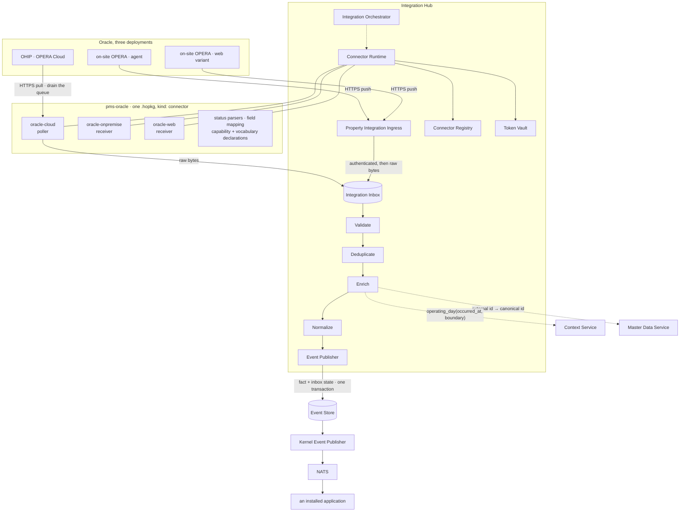
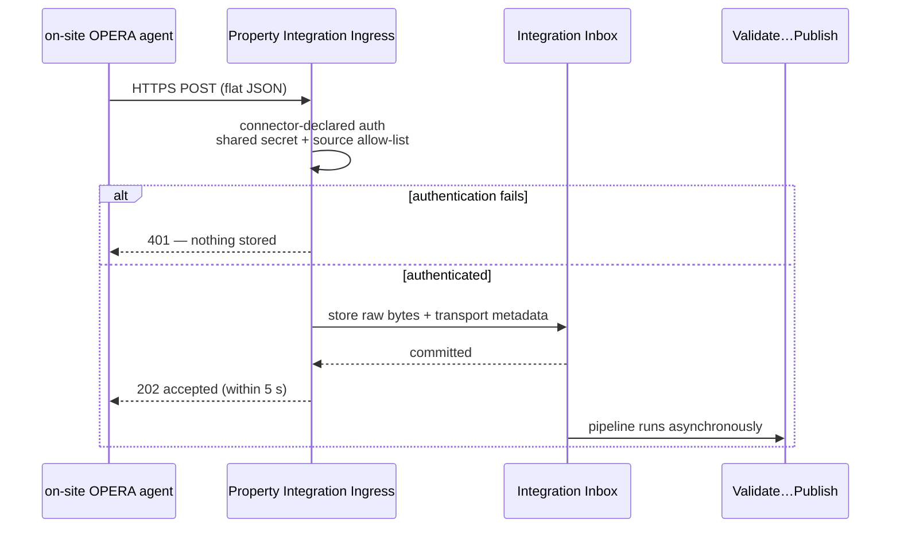
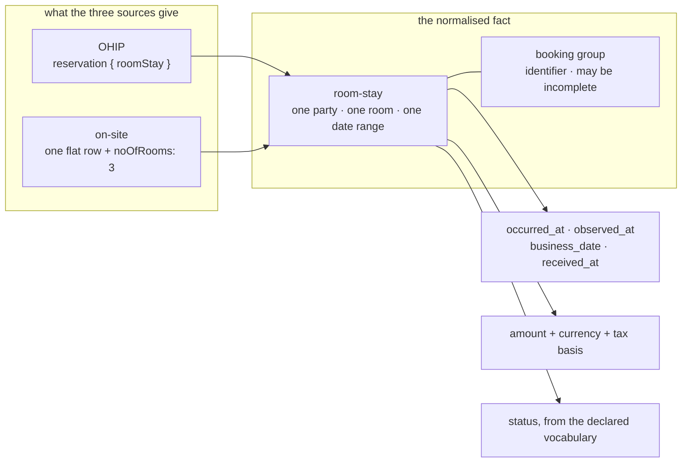

# 03 · The Oracle connector — how we implement what the reference implements

**Status:** design, 2026-08-31. Stream DD, deliverable 6 of the connector
round — brief `docs/working/42-the-connector-round.md` §3, **in the platform
repository**.
**Under:** ADR 0128 (one Hub · `kind: connector` · HTTP ingress at the Hub ·
inbound-only · the Hub owns the mechanics · business date shape (a)) and the
owner's `CONN-Q2(a)` ruling — **Oracle first, three flavours as three
integrations in one `pms-oracle` package**.
**Built on:** the study (`01-…`), the requirements (`02-…`, R1–R28), the gap
analysis (`docs/working/42b`) and the cross-vendor survey (`docs/working/42c`).
**The Hub's own design is §7–§20 of the platform brief.** This page is the
connector's half: what `pms-oracle` does, and how it differs from the system
that did it before.

---

## 0 · What this page is for

The reference is **37 574 lines of production Java across 605 files** that
does, today, in hotels, what this connector will do. It works. The question
this page answers is not *"is ours nicer"* — it is:

> **For each thing that went wrong there, what in our design means it cannot
> go wrong the same way here?**

§2 answers it one defect at a time, and grades each answer honestly: some
mechanisms make a defect **inexpressible**, some make it **refused**, and some
merely **remove the occasion** for it. A page that called all three
"impossible" would be doing what the reference's comments did — asserting an
outcome nobody can check.

---

## 1 · The architecture

Three integrations, one package, one Hub. Every box is named as ADR 0128 and
the diagrams name it.



### 1.1 · `oracle-cloud` — the poller

The only outbound integration of the three, and the only one whose source is
**destructive**.

```mermaid
sequenceDiagram
    participant RT as Connector Runtime
    participant TV as Token Vault
    participant C as oracle-cloud
    participant O as OHIP
    participant IB as Integration Inbox
    participant P as Validate…Publish

    RT->>C: poll due (per-property schedule, property time zone)
    C->>TV: read credential
    TV-->>C: OAuth2 grant material
    C->>O: token request
    O-->>C: access token + expires_in
    Note over RT,TV: expiry is honoured, not guessed;<br/>refresh is the Hub's lifecycle, diagram 28

    loop until the queue answers empty
        C->>O: GET businessEvents
        O-->>C: a page of notifications (id, module, action, primary key)
        C->>IB: store raw bytes
        IB-->>C: committed
    end
    Note over C,IB: the queue is consumed by reading it —<br/>store-before-process is the whole guarantee (R22)

    IB->>C: for each stored notification
    C->>O: GET the reservation by id
    O-->>C: the record
    C->>IB: store the fetched record against the notification
    IB->>P: pipeline runs from stored bytes
```

**Four things this drawing commits to.** The token's own `expires_in` governs
refresh, not a constant. The drain stores each page **before** the next page is
requested. The read-back is a second stored artefact, not a transient value —
so a failure between notification and record is recoverable. And the pipeline
runs from the inbox, never from a variable in the poller.

### 1.2 · `oracle-onpremise` and `oracle-web` — the receivers



**The acknowledgment is the commit.** The agent is told "accepted" only after
the bytes are durable, and never as a side effect of processing having
succeeded — the two are separated so that a slow pipeline cannot turn into a
lost push, and a failed pipeline cannot turn into a repeated one.

### 1.3 · Normalisation — anchored to the room-stay



**Why the room-stay and not the reservation.** `42c` §2 found that the level a
vendor calls a "reservation" inverts between vendors — Apaleo's booking
contains reservations, Oracle's reservation contains the room stay, the on-site
flavours send one room and a count. Every source can produce a room-stay;
anchoring higher would force the on-site flavours to invent siblings they were
never sent, which is exactly the `-1` sub-reservation identifier the reference
minted by string concatenation.

`business_date` is attached **by the Hub**, from
`operating_day(occurred_at, boundary)` — the connector never computes it
(ADR 0128 §6).

---

## 2 · The reference's defects, and what makes each one different here

One row per defect. **The grade is the honest part**, and it is not the same
for every row:

```text
INEXPRESSIBLE   the mechanism means the defect cannot be written down
REFUSED         it can be written, and the platform rejects it — at build,
                install, or run — with a diagnostic
NO OCCASION     the structure removes the situation that produced it; a
                determined author could still err, and would have to try
```

### 2.1 · A read timeout is treated as success

**There** — all four downstream writes returned success on a socket timeout
(`common/services/InstioGuestEntryServiceImpl.java:30-36, :77-80, :105-108,
:133-136`), because without an idempotency key the only alternative was
double-checking-in a guest. The integration guessed, and guessed towards losing
an event.

**Here** — the question does not arise, because **the connector performs no
write whose success is in doubt.** Publication is a local transaction against
the Event Store (design §9.6): the fact and the inbox row commit together or
neither does. There is no remote call to time out between deciding and
recording. Downstream delivery is the Kernel's Event Publisher relaying at
least once, and every consumer already deduplicates on `event_id` and discards
a stale `entity_version` (Chapter 21).

> **INEXPRESSIBLE.** There is no code path in which a connector reports a
> success it is not certain of, because there is no remote write for it to be
> uncertain about. The three defences the round assembled — Chapter 27's
> `Idempotency-Key`, diagram 08's `Deduplicate` stage, the Event Store's
> `UNIQUE (aggregate_type, aggregate_id, entity_version)` — are what make
> at-least-once delivery safe underneath that.

### 2.2 · A destructive drain loses events on any failure

**There** — the OHIP queue is consumed by reading it; on a transport failure
after the drain the events were gone from the source and had never been stored
(`cloud/services/impl/OracleCloudEventServiceImpl.java:50-84`). The loop also
never terminates on any status that is neither 200 nor 204.

**Here** — the inbox stores raw bytes **before** validation, and the
acknowledgment or the next page request happens only after that commit
(design §9.1, §1.1 above). ADR 0128 §5 makes the durable inbox a Hub facility,
so the connector cannot skip it: it has no other way to hand a payload on.

> **INEXPRESSIBLE for the loss.** A connector's only outlet is the inbox, so
> "read and did not store" has nowhere to happen.
> **REFUSED for the loop:** the drain's terminating condition is the Hub's
> paging facility, not connector code, and an unexpected status ends the poll
> with a recorded error rather than a spin.

### 2.3 · No identifier mapping — PMS room numbers carried verbatim

**There** — the PMS's room number went straight into the downstream record
(`cloud:217`, `onPremise:314`, `web:373`) and its reservation id *was* the
downstream key. A renumbering in OPERA silently repoints every record. The only
mapping table was room-type-code to human description.

**Here** — ADR 0016 governs: property-scoped, bijective in both directions,
`UNIQUE (property_id, integration, entity_type, entity_id)` and
`UNIQUE (property_id, integration, entity_type, external_id)`. An unmapped
external id makes the fact **unmappable** (design §14) — held with its raw
bytes, never published. `integration` is the registered connector identifier
(`oracle-cloud`, not `oracle`), so the three flavours cannot collide.

> **REFUSED.** The Enrich stage has no path that emits a canonical field it did
> not resolve; the outcome is `unmappable`, which is a visible operator queue
> rather than a silent pass-through.
> **Open:** `CONN-Q8` — OHIP gives several typed identifiers per entity, and
> until the mapping key gains an identifier kind the Hub maps one kind per
> entity type, declared by the connector. §4.

### 2.4 · `permitAll()` — every inbound endpoint unauthenticated

**There** — `co/instio/global/security/WebSecurityConfig.java:35`; the property
identity arrived in the request body as `PropertyCode` and was trusted; the one
auth filter acted only if the caller chose to send a header.

**Here** — the Property Integration Ingress applies **connector-declared**
authentication (ADR 0128 §3): shared secret, signature, source allow-list, or a
combination. `pms-oracle` declares secret **and** allow-list for both push
flavours. A connector declaring none does not install.

> **REFUSED at install.** The declaration is part of the signed manifest, so
> "no authentication" is not a runtime oversight that ships — it is a package
> that fails validation.
> **And the property is not taken from the body:** the ingress path identifies
> the configured integration, and the body's own property code is *checked
> against* it rather than believed.

### 2.5 · Secrets in a checked-in properties file

**There** — `src/main/resources/application.properties` carried the OHIP client
secret and app key (`:125-134`), three database passwords (`:31-45`), the
broker password (`:189-193`) and the per-provider keys (`:141-143`); the JWT
signing key was a literal in source; an in-memory `admin`/`password` account
existed.

**Here** — credentials go to the **Token Vault** at configuration time and are
read at runtime. ADR 0128 §2: a connector package contains *"never property
credentials, secrets, certificates, or authorization tuples"*. The package is
signed with a per-file digest inventory (ADR 0092), and configuration is
per property.

> **INEXPRESSIBLE for shipped secrets.** A credential in the package would be
> a credential in a signed, published, catalogue-listed artefact identical for
> every property — there is no per-property file to put it in, because the
> package is not per property.
> **NO OCCASION for the rest:** the platform's own secrets come from the
> property secret store, and `gitleaks` runs in `make check`.

### 2.6 · A blank time zone silently becomes `Asia/Kolkata`

**There** — `co/instio/global/utils/DateUtils.java:171-184` fell through to an
overload with the zone hardcoded, so a property with no configured zone
produced timestamps wrong by the offset, silently, while still looking correct.
The daily housekeeping sweep hardcoded the same zone for every property.

**Here** — requirement R16: a property's time zone is **required input, never a
default**, it is an IANA zone, and **a UTC offset does not satisfy it** (amended
from `42c`'s Cloudbeds finding — an offset cannot express daylight saving). The
zone comes from Core Administration's Property Registration; the integration's
configuration screen shows it and cannot edit it.

> **REFUSED.** A derivation without a zone fails rather than approximating.
> The mockup draws this: the field is present, locked, and labelled with where
> it comes from — so the one place someone might otherwise type a wrong zone
> does not accept typing.

### 2.7 · Two databases per provider, and a `property` table in each

**There** — every provider owned a MySQL schema (`property`, `configuration`,
`token`, `room_info`) *and* a MongoDB database (`reservation`, `event`,
`reservation-history`, `reservation_dumb`). `common/constants/DbConstants.java:20-66`
shows the same table names repeated per provider, kept apart only by living in
different databases. Nine copies of property data. The Mongo URI was hardcoded
in Java; the schema came from `hibernate.hbm2ddl.auto=update`.

**Here** — **the connector owns no database.** The Hub owns the `integration`
schema (inbox, outbox, mappings, sync state, errors — Chapter 21); Master Data
owns properties and rooms; the Token Vault owns credentials. The connector owns
the *mapping rules*, not the mapped data.

> **INEXPRESSIBLE.** A `.hopkg` gets a database role only through its manifest's
> `database.schema`, and a connector declares none — so there is no credential
> with which to create a `property` table, and CLAUDE.md §"No duplicated master
> data" is enforced by the absence of a grant rather than by a review comment.

### 2.8 · Per-provider copy-paste of the mechanics

**There** — each provider re-implemented polling, retry (or its absence),
caching and locking. The guarantee cache was keyed on `hotelId` while the API
was queried per arrival date, so one property served one hour of wrong
policies. The lock service was a JVM-local `ReentrantLock` map whose timeout
release unlocked from a thread that did not hold it. Two providers carried the
identical 45-minute token constant with the scheduler commented out.

**Here** — ADR 0128 §5: the durable inbox, offline queue, retry and backoff,
deduplication, delivery state, sync checkpoints and cache are **Hub platform
facilities**. *A connector never implements a queue.* The connector supplies
endpoints, the authentication adapter, request/response mapping, the status
parser, normalisation rules, the dedupe promise, and its capability
declarations.

> **NO OCCASION**, and this row is the honest one. Nothing stops a connector
> author writing a `ConcurrentHashMap` cache inside their own code. What
> changes is that they have no reason to: the facility exists, it is the only
> thing wired to the pipeline, and a private cache would be invisible to
> Operations Center and unreplayable. The reference's authors were not careless
> — they had no platform to put this in.

### 2.9 · Two more, from the study

| | There | Here | Grade |
|---|---|---|---|
| **An unmapped status became `null`** — every `switch` ended `default: return null`, which is why nobody can say what those PMSs emit | `cloud/services/OracleCloudBaseService.java:90-147`, and the same shape in five other providers | The vocabulary is **declared** per integration; an unmapped value is a **rejected** record naming the value, visible in Operations Center | **REFUSED** |
| **Failures and supersessions shared one bucket** with an untyped `dumbReason` string, so replaying a stay's history re-applied stale state | `onPremise:361-366`, `web:424-431` | Four outcomes — rejected · unmappable · deferred · superseded — differing in retention, alerting and replay; **superseded is not selectable for replay** | **INEXPRESSIBLE** for the stale-replay case |

---

## 3 · "Are we more structured than the Java?" — with evidence

The honest frame first: **the reference is a working production system and this
is a design.** A design has not yet met a hotel at 2 a.m. So this section does
not claim we are better engineers. It claims something narrower and checkable:

> **There are rules here that the reference had no equivalent of, and for each
> one there is a specific failure in that codebase which the rule would have
> prevented.**

Where the rule would *not* have prevented the failure, this section says so.

### 3.1 · Rules with a named counterpart failure

| Our rule | What it says | The failure it would have prevented |
|---|---|---|
| **No duplicated master data** (CLAUDE.md) | `masterdata.rooms` is canonical; applications reference it | `DbConstants.java:20-66` — `property`, `configuration`, `room_info` repeated for **nine** providers in nine databases. There is no single answer to "what rooms does Kochi have" |
| **Event-driven communication** (CLAUDE.md) | Applications communicate through events, never direct calls into another's services | `InstioGuestEntryServiceImpl.java:51-55` — a synchronous HTTP call with the API key in the query string, whose timeout produced §2.1's guess. An appended event has no timeout to interpret |
| **Context over joins** (CLAUDE.md) | Ask the Context Service; do not join across domains | The reference correlated a check-in by querying its own Mongo on `(companyId, siteId, surname, firstName, arrivalDate)` — `OracleOnPremiseReservationDaoImpl.java:49-83`. Entity resolution by name, in the connector, against its private copy |
| **ADR 0036 — the 300-line ceiling** | A hard cap, checked by `check_source_standards.py` | `OracleWebReservationServiceImpl.java` is **433 lines** and holds the live processor plus two commented-out predecessors, one richer than the live one. `OracleOnPremiseReservationServiceImpl.java` is **385**. Nothing objected |
| **ADR 0038 — one file, one purpose** | Independently of length; write the one-line summary first | `OracleCloudBaseService.java` holds five configuration values, two HTTP-entity builders, three status parsers **and a `main()`** — 160 lines that no ceiling would have caught |
| **ADR 0025 — tests live in their own package** | No test code in a production file, no exceptions | **`src/test/` exists and contains zero files.** 37 574 lines of production Java, 605 files, and **11 `public static void main`** methods used as scratch tests inside production classes — including one in `OracleCloudBaseService.java:149-159` demonstrating the multi-stay room case, which is real domain knowledge with nowhere to live |
| **ADR 0055 — no native SQL** | ORM expression language only | **7 files** carry `nativeQuery = true`. The property-resolution query is repeated verbatim in three Oracle flavours; a column rename breaks all three at runtime |
| **No secrets in code** + `gitleaks` in `make check` | Secrets come from the vault | §2.5's properties file — which a secret scanner in CI would have refused |
| **No hardcoded integrations** | All integrations go through the Hub | `HousekeepingBackgroundService.java:35-45` injects **five named provider repositories** and enumerates them at `:54-67`. Adding a provider means editing a housekeeping file |
| **ADR 0016 Part 2 — emit the business fact** | Not `sync.completed`, not process events | The reference emitted nothing; state moved by direct call. The rule is what makes §2.1's answer available at all |

### 3.2 · The register, and the thing it would actually have caught

`docs/decisions/questions.md` has no counterpart in the reference, and the
failure it maps to is the most characteristic one in that codebase:

> **Three mechanisms for out-of-order arrival, none of them removed.**
> Per-flavour `forceCheckIn` / `forceCheckout` flags; `directCheckIn` /
> `directCheckout` fallbacks marked `//Todo remove after data flow is ok`; and a
> commented-out replay that would have injected a check-in before a check-out
> (`cloud:105-109`). Three answers to one question, live simultaneously, with
> the decision record being the comments themselves.

A register does not make anyone wiser. What it does is make *"which of these is
the rule"* a question with an address. This round asked nine questions that way
— `CONN-Q1` through `CONN-Q9` — and two of them (`Q3`, the three connector
platforms; `Q6`, the business date) were contradictions between our **own**
documents that nobody had noticed until the question was written down.

### 3.3 · Where the comparison does not flatter us

Four things worth saying plainly, because a section like this is worthless if
it only lists wins.

* **The reference ships and we do not.** Every defect above is visible *because*
  someone shipped an integration against a real OPERA and kept the workarounds
  where they could be read. Our equivalents are untested by contact.
* **Some of our answers are the same answer, better placed.** The reference's
  `dumbReason` dead letter and our four outcomes are the same idea; ours is
  typed and theirs is a string. That is a real improvement and a small one.
* **We have more rules than they had, and rules have a cost.** Nine questions
  and one ADR were spent before a line of connector code existed. That is
  defensible for a platform meant to last ten years and it is not free.
* **One of our best mechanisms is unbuilt.** ADR 0061's authorization
  materialisation is deferred, so tuples are written by nothing today. We are
  comparing our design against their implementation, and the honest word for
  the gap is *"not yet"*.

---

## 4 · What stays open

Named here so nobody has to infer them, and so the owner's gate is written
down rather than remembered.

| | State | What it blocks |
|---|---|---|
| **`CONN-Q9` — who renders configuration?** | **Open.** ADR 0128 is silent on connector UI; ADR 0092's manifest allows `ui.module` and calls its absence "headless". The design and the mockup assume headless — Software Center's Integration Manager renders the form from declared configuration — but ADR 0092's configuration block is `key / type / default / scope`, which cannot express a Vault-written secret, a source allow-list, a two-tier polling schedule, or a *Test connection* action. Either that schema grows or a connector ships its own module | **The configuration surface, and therefore the start of code** |
| **The Reservations/GuestOps domain** | **Ruled and unbuilt** — `CONN-Q2(b)`, ADR 0089. Reservation and guest facts normalise and are held as **deferred**, with their business date and provenance, and replay into the domain the day it ships | Nothing in this connector. Which facts publish is Hub configuration, not connector code |
| **The two listener rows** | **Proposed, not taken.** `integration` 15156 and `integration-ingress` 15157 continue the `1515x` family below 49152 (ADR 0104). `packages/property-facing` is Stream CC's table | The ingress endpoint in frame 4 of the mockup — the port shown there is the proposal, not a decision |
| **`CONN-Q8` — the mapping key's identifier kind** | **Open** (an amendment to accepted ADR 0016). Until ruled, the Hub maps **one identifier kind per entity type**, declared by the connector as its primary; the others ride on the fact as external references and are not mapped | Nothing now; a v1 restriction with a name |
| **The business date's storage home** | **Reported back to the planner** — ADR 0128 §6. The substance is ruled (derived, not stored; attached at normalisation; the connector never computes it) and this design commits to the substance | Nothing now |
| **Inbound webhooks from a cloud PMS** | The property ingress is reachable on the property LAN; a cloud PMS's webhook comes from the public internet. ADR 0115's Edge Gateway is the shape that would answer it | Nothing for Oracle — the cloud flavour is polled and the two on-site flavours are LAN pushes. It is the **first cloud-PMS connector's** blocker |

### The gate, written down

> **Code starts when the owner has read this page and
> `docs/mockups/01-oracle-connector.html`, and `CONN-Q9` is ruled.**

The mockup follows this page. `CONN-Q9` is the planner's.

---

## 5 · What this page does not contain

* **No Hub design.** That is §7–§20 of the platform brief; this is the
  connector's half.
* **No code, and no file tree for one.** The proposed service tree is the
  platform brief's §19; `pms-oracle`'s own layout waits on `CONN-Q9`, because
  whether the package carries a UI module changes it.
* **No claim that the reference was badly built.** §3.3 says where the
  comparison does not flatter us, and §0 says why the question is not "is ours
  nicer".
* **Nothing copied.** Every citation points into the read-only reference
  outside both repositories.
