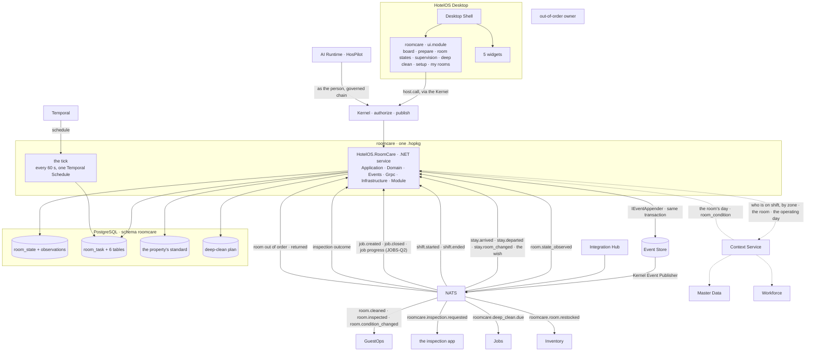

# 03 · The Room Care design — how we implement what the walkthrough locked

> **Design of record**, with `01-the-roomcare-reference-survey.md` and
> `02-the-roomcare-walkthrough-and-sign-off.md` (`RC-Q1(1)`, the
> `JOBS-Q1(1)` shape). Every section cites the walkthrough section or the
> ruling it implements. Where a line depends on another application's round
> or on a ruling not yet given, it says so, names the row, and stops there.
> **Nothing is built from this page until the mockups are redlined and
> locked** — the gate is §9.

---

## 0 · What this page is for

The walkthrough is the *what*, in the owner's language, locked on
2026-09-05 after eight sections, thirteen guest cases and a thirteen-scenario
pass. This page is the *how*: the tables, the events, the permissions, the
manifest, what Temporal does, the screens — and, as Jobs' and the Oracle
connector's pages did, **for each thing that went wrong in the reference, what
here means it cannot go wrong the same way**, graded honestly:

```text
INEXPRESSIBLE   the mechanism means the defect cannot be written down
REFUSED         it can be written, and the platform rejects it with a diagnostic
NO OCCASION     the structure removes the situation; a determined author could still err
```

Nothing on this page is a decision. Where the walkthrough ruled, this page
implements; where it left something with the architect or another
application's round, this page marks it with the row id and builds a **port
with no adapter** — the house pattern the planner named on `JOBS-Q2`.

The vocabulary is ours throughout — `APPS-Q3` and the owner's method ruling:
none of the reference's names appears below, and no reference mechanism is
built.

---

## 1 · The architecture

One installable package, `kind: dotnet-service`, one schema `roomcare`, two
event domains it publishes into (`room` for the room's condition, `roomcare`
for its own work), one signed `ui.module`, five widgets. Every box is named as
the platform names it.



Five lines of it are rules, not drawing:

* **Room Care sets the room's condition and announces it, in one
  transaction.** `room.cleaned`, `room.inspected` and the rest are appended
  through the SDK's `IEventAppender` with the change; `entity_version` is the
  room-state row's `version`, bumped in the same commit (walkthrough S0;
  Chapter 12; diagram 42; `HUB-Q4`). Nothing waits for the PMS.
* **Room Care calls no other application and asks the PMS nothing.** Every
  cross-application fact is an event in or an event out with a correlation
  id (`EVT-Q3`); every cross-application *question* goes to Context (S0 §2 of
  the note to the architect).
* **Room Care holds no per-room timers.** One Temporal Schedule wakes the
  tick; the tick compares timestamps already on the rows (§6). Re-checks,
  window edges and the day roll are all the tick's.
* **Room Care rosters nobody and writes nothing another application owns** —
  no shift, no attendance, no capacity, no request, no preference, no
  catalogue, no stock, no checklist, no out-of-order state (the note to the
  architect §3).
* **Room Care writes no authorization tuple.** It declares one grant kind and
  publishes its two events; the Kernel materialises `property#roomcare_manager`
  (`AUTHZ-Q25`; S6).

---

## 2 · The schema — `roomcare`

One schema, owned by the package, migrated by its own `migrate` verb (ADR 0103
addendum). Every table carries `property_id` (RLS-backed) — the one scope
column. Every id is a UUIDv7 generated by the application. Every "who" is
`{ kind, id }` — `actor_kind` · `actor_id` — never a name; `actor_kind` is
`USER · SYSTEM · APPLICATION`, and a person acting through HosPilot is a `USER`
with `via = HOSPILOT` on the row (S7). Timestamps are UTC instants; the
operating day is a date by Context's rule — built over Master Data's two
columns, §9's build amendment 2 — stored where a row belongs to a day. Logical removal, where a table has it, is `deleted_at · deleted_by`
(the ADR 0062 vocabulary, as `JOBS-Q1(6)` allows an application's records).

### 2.1 · `room_state` — one row per room, the thing Room Care owns

| Column | Type | Rule |
|---|---|---|
| `room_id` | uuid PK → `masterdata.rooms` | never a `roomcare.rooms`; the room is Master Data's (ADR 0051) |
| `property_id` | uuid | RLS |
| `condition` | enum | `DIRTY · CLEAN · INSPECTED` — the platform's `RoomCondition` values Room Care may set; `OUT_OF_ORDER` / `OUT_OF_SERVICE` are **never written here** — they are the block (§2.9) |
| `condition_set_at` · `condition_set_by_{kind,id}` · `condition_source` | | `source`: `ATTENDANT · INSPECTION · SUPERVISOR · PMS · GUESTOPS · MANUAL · SYSTEM` — the provenance every change carries (S4); `MANUAL` is shown as such wherever the condition is shown |
| `occupancy` | enum | `VACANT · OCCUPIED · UNKNOWN` — **observed**, never set here |
| `next_sold_at` | timestamptz, null | observed from `RoomState.next_sold_at`; the priority input (S0) |
| `stay_statuses` | enum[] | the observed list, as the wire carries it — never reduced to one |
| `is_pseudo_room` | bool | observed; a pseudo room is never on a list (survey R1) |
| `disagreement_observed_condition` · `disagreement_observed_at` · `disagreement_source` | null | set when an observation newer than `condition_set_at` contradicts `condition` in *Room Care leads* mode; cleared by `roomcare.amend` with `disagreement_cleared_{by,at,kept}` (S4) |
| `linen_last_changed_on` | date, null | **the room's**, reset by every departure clean and by a daily service that changed linen (S5 c11) |
| `days_without_service` | int | consecutive operating days ending `DECLINED` or `DND` in both windows; reset by any service; the supervisor's threshold reads it (S5 c9, row 7) |
| `supervised_since` | date, null | set on the day the threshold fires; **never cleared while the stay continues** — every later DND day is the supervisor's (S5 c9) |
| `created_at` · `updated_at` · `version` | | `version` is the optimistic guard and the event's `entity_version` |

**Not on the table, by ruling:** a *special status* enum, a DND boolean, a
service-status enum, a "before/after service" snapshot — each was the
reference's fourth copy of one fact (survey F19, F22); here an exception is a
task outcome (§2.4) and a wish is GuestOps's.

### 2.2 · `room_observation` — every inbound fact, applied or not

| Column | Rule |
|---|---|
| `observation_id` · `room_id` · `property_id` | |
| `source` | `PMS · GUESTOPS · MANUAL · ENGINEERING · SYSTEM` — the Hub's fact, GuestOps's stay event, a person entering it in Room Care (redline 4, 2026-09-13: **available at every property, never gated**; a `MANUAL` observation is a deliberate act for the ordering clause), the out-of-order owner, the tick |
| `occurred_at` · `operating_day` | the fact's own time and business date (`FactHeader`) |
| `occupancy` · `condition` · `stay_statuses` · `next_sold_at` · `is_pseudo_room` | what was said |
| `applied` | bool — **the ordering clause**: applied unless it contradicts a later deliberate act (`condition_set_at > occurred_at` with `condition_source` in `ATTENDANT · INSPECTION · SUPERVISOR`) |
| `outcome` | `APPLIED · OLDER_THAN_ACT · DISAGREEMENT_FLAGGED · APPLIED_PMS_LEADS` (S4) |
| `event_id` | idempotency |

An observation is never edited; the row is the record of what the PMS said
and what Room Care did with it.

### 2.3 · `room_task` — one per room per operating day per service

| Column | Type | Rule |
|---|---|---|
| `task_id` | uuid PK | |
| `property_id` · `location_id` | uuid | `location_id → masterdata.locations` — a ROOM node **or a public-area node** (`LOBBY · CORRIDOR · RESTAURANT · POOL · TERRACE · BACK_OF_HOUSE`, `masterdata/v1/dto.proto:207–219`); `room_id` is set when the node is a room (S3) |
| `operating_day` | date | from Context; a task never expires at the roll — a departure clean due in the arrival's day belongs to that day (S0 midnight case) |
| `window` | enum | `MORNING · EVENING` (S5 c2) |
| `service` | enum | `DEPARTURE_CLEAN · DAILY_SERVICE · TURNDOWN · REFRESH · AREA_CLEAN` — the four services and the area's routine (S0, S3) |
| `priority` | enum + `priority_rank` int | `SOLD_TONIGHT · DEPARTURE · DAILY · REFRESH` and a rank within it — the ladder is the property's (§2.8) |
| `earliest_at` | timestamptz, null | from the guest's timing wish (S5 c3) |
| `linen_due` | enum | `NOT_DUE · DUE · MUST` — computed from `linen_last_changed_on` and the property's linen rule at creation and on each reconcile (S5 c4) |
| `minutes_expected` · `credits` | | from the standard for `room_type × service` |
| `inspection_rule` | enum | `NONE · ALWAYS · ARRIVALS · EVERY_NTH · VIP` — copied from the standard at creation so a later edit never rewrites this task |
| `status` | enum | `PENDING_POLICY · PLANNED · ASSIGNED · IN_PROGRESS · ENDED · CLOSED_BY_POLICY` — the lifecycle; **how** it ended is `outcome` |
| `outcome` | enum, null | `DONE · PARTIAL · DECLINED · DND · SKIPPED_BY_GUEST · NOT_REACHED · SUPERVISOR_DND_APPROVED · SUPERVISOR_CLEANED · SUPERVISOR_DECIDED` — every room, every window, has one (S5 c1, c9) |
| `partial_done` | enum[] | `BATHROOM · TOWELS · RUBBISH · BED` when `PARTIAL` |
| `decided_by` · `decision_run_id` | | `PREPARE · AUTOMATIC · SUPERVISOR · SYSTEM` and the run (§2.7) — the decision is recorded with its inputs, never re-derived |
| `decision_inputs` | typed record (jsonb, schema-validated) | `condition · occupancy · stay_statuses · next_sold_at · wish · window · rule_version` at decision time |
| `assigned_to_user_id` | uuid, null | the current assignee — a projection of the open `task_assignment` row, kept in the same transaction (the derived-projection rule) |
| `created_at` · `updated_at` · `version` | | |

**Not on the table:** a profile, a workflow list, a "call for inspection"
phase, a task-level service status, a follower set, a company task number —
the reference's (survey §2.2). A task has no human-facing number: the room
number and the day are its name.

### 2.4 · The six beside it — one fact each

| Table | Row per | Columns |
|---|---|---|
| `task_phase` | each phase of a task | `phase` `STRIP · CLEAN · MAKE_UP · DONE · INSPECT` · `sequence` · `status` `PENDING · ACTIVE · DONE · SKIPPED · FAILED` · `started_at` · `ended_at` · `by_user_id` · `note` — the property's phases per service, copied at creation (S0) |
| `task_attempt` | **every time an attendant reaches the door** | `at` · `by_user_id` · `found` `DONE · PARTIAL · DECLINED · DND` · `partial_done` · `note` — the DND re-check trail (S5 c1 way 4); the task's `outcome` is the last attempt's, or the window's close |
| `task_assignment` | each hand-over | `user_id` · `assigned_by_{kind,id}` · `via` · `assigned_at` · `ended_at` · `end_reason` `REASSIGNED · ENDED · SHIFT_ENDED` · `mode` `PROPOSED · ACCEPTED · MANUAL` — **current = `ended_at IS NULL`** |
| `task_work_session` | each stretch of one person's work | `user_id` · `started_at` · `ended_at` · `end_reason` `PAUSE · END · REASSIGNED` · `minutes` — **accumulates across pauses** (survey F24) |
| `task_history` | each transition and each decision | `at` · `by_{kind,id}` · `via` · `from_status` · `to_status` · `reason` · `kind` `TRANSITION · REDUCTION · REPRIORITISED · SUPERVISOR_DECISION · DISAGREEMENT_CLEARED` — the supervisor's overrides live here with their reason (S5 c9) |
| `task_job_touch` | each `job.closed` against the task's room on its day | `job_id` · `closed_at` · `summary` — *"extra service 16:50 · J-1183"* so the day reads whole (S5 c8) |
| `task_issue` | **each fault an attendant finds during a clean** (mockup redline 2, 2026-09-05) | `task_id` · `room_id` · `item_hint` (Jobs' catalogue id, via Context; null if Jobs absent) · `note` · `media_id` · `by_user_id` · `at` · `correlation_id` · `job_id` (from `job.created`, null until it arrives) — **the attendant's own record, never lost**; Jobs creates the job and answers (`EVT-Q3`); replayed when Jobs installs later (`EVT-Q4`) |

### 2.5 · `room_supervision` — the supervisor's lane

| Column | Rule |
|---|---|
| `room_id` · `property_id` · `operating_day` | one row per supervised room per day |
| `reason` | `DAYS_WITHOUT_SERVICE` (the threshold) · `DISAGREEMENT` · `ARRIVAL_BEFORE_WINDOW` · `NOBODY_AVAILABLE` |
| `decision` · `decided_by_user_id` · `decided_at` · `note` | `DND_APPROVED · CLEAN · OTHER` — **the supervisor's, final, and the window does not close on the room until it exists** (S5 c9) |

### 2.6 · `restock` — the attendant's act only

| Column | Rule |
|---|---|
| `task_id` · `room_id` · `stay_id` (null) · `at` · `by_user_id` | |
| `items` | `[{ item_id, quantity }]` — `item_id` from Inventory's catalogue **read through Context**; no name, no price, no stock (`RC-Q2`, S1/S2) |

Absent Inventory, the capability that writes this table is not shown (§8).

### 2.7 · `prepare_run` — the button

| Column | Rule |
|---|---|
| `run_id` · `property_id` · `operating_day` · `window` | |
| `at` · `by_{kind,id}` · `via` | `USER` pressing, `USER via HOSPILOT`, or `SYSTEM` in automatic mode |
| `kind` | `FIRST · RECONCILE` — the first press builds the day; every later press reconciles (S0) |
| `rooms_considered` · `tasks_created` · `tasks_updated` · `tasks_skipped` · `pending` · `unassignable` | the counts the board shows |
| `changes_since_previous` | what "N new since 08:00" counted |

### 2.8 · The property's standard — configuration, versioned

| Table | Scope | Columns |
|---|---|---|
| `service_window` | property | `window` `MORNING · EVENING` · `starts` · `ends` (may cross midnight) · `enabled` · `allow_assignment_outside` (S0) |
| `service_standard` | property × room type × service | `minutes` · `credits` · `inspection_rule` · `checklist_ref` (the inspection app's id, opaque here) · `phases[]` — ADR 0044's row, in rows not columns |
| `property_policy` | property, one row, versioned | `trigger_mode` `PREPARE · AUTOMATIC` · `who_leads` `ROOM_CARE · PMS` · `stay_source` `PMS · GUESTOPS · MANUAL` (what the board expects and warns about — *PMS silent since*; gates nothing) · `board_default_view` `MAP · WALL` · `states_default_view` `SHEET · TAP_GRID · COMPACT` (redline 5) · `on_departure_condition` `DIRTY` · `linen_rule` `{ kind: EVERY_N_DEFERRABLE \| MUST_BY_N, n }` · `towels` `DAILY \| GREEN_PROGRAMME` · `refresh_after_days` · `dnd_recheck_minutes` · `dnd_recheck_until` `WINDOW_END` · `supervisor_after_days` (default 2) · `priority_ladder[]` · `assignment_strategy` `CONTINUITY · SAME_ZONE · LOWEST_LOAD` · `unsold_departure` `TODAY \| MAY_WAIT` · `version` · `changed_by` · `changed_at` |
| `area_schedule` | property × location | `times[]` (`every 2 h 06:00–22:00`, `after MORNING`, `at 05:30`) · `service_standard_id` (S3) |
| `deep_clean_plan` | property × room type | `every_months` (S0) |
| `room_zone_assignment` | property × room | `zone_id → masterdata.zones` · `effective_from` · `effective_until` · `assigned_by` — **ADR 0044's aggregate, Room Care's** |

**Policy resolution** at decision time: the room type's `service_standard`
for the service → the property's `property_policy`; the versions used are
stamped into `decision_inputs`, so editing the standard never rewrites a
past day (S3's per-property rule, made auditable).

### 2.9 · `deep_clean` — the planned project

| Column | Rule |
|---|---|
| `deep_clean_id` · `room_id` · `property_id` | |
| `due_on` | from `deep_clean_plan` and the last `done_on` |
| `window_from` · `window_to` | the supervisor's pick (`roomcare.plan`) |
| `block_correlation_id` · `block_applied_at` | the request to the out-of-order owner and its answer — **a port with no adapter until the architect rules who places the block** (the note §2, open) |
| `job_correlation_id` · `job_id` · `job_status_seen` · `job_progress` | `job_id` from `job.created` (`EVT-Q3`); progress from the events `JOBS-Q2` will publish — **consumed against the ask as registered, nothing assumed beyond the event boundary** |
| `status` | `PLANNED · BLOCK_REQUESTED · BLOCKED · IN_PROGRESS · RETURNING · DONE · CANCELLED` |
| `done_on` | set when the departure clean and inspection after the job close (S0) |

**Not built:** a multi-day assignment, a per-day hand-over, a step list —
Jobs' (`JOBS-Q2`).

### 2.10 · Row Level Security, and the read views

Every table above except the organization-less standard carries
`property_id`, and RLS on the package's role backstops every query (Jobs'
§7.3, applied here). Two views are exposed and nothing else:

* **`room_day`** — per room, per operating day: the tasks, every attempt,
  the outcomes, the supervisor's decision, the job touches, the linen date —
  **the read Context serves to GuestOps** (S5 c12; `CTX-Q4`: view + RPC,
  display-only, this round's delivery).
* **`room_condition_now`** — `room_id · condition · source · set_at` — what
  fills `RoomContext.room_condition` (`context/v1/dto.proto:216`).

---

## 3 · Events

Every state change appends an event in the same transaction as the row.
Payloads are typed records serialised `SnakeCaseLower` by the SDK's
`EventAppender`, `[JsonPropertyName]` on every member, a wire-shape test
asserting the literal strings (Jobs §3, the `EVT-Q4` / `AUTHZ-Q20` lesson).

### 3.1 · Published — domain `room` (aggregate: the room, `entity_version` = `room_state.version`)

| Event | When | Carries, beyond the envelope |
|---|---|---|
| `room.cleaned` | condition → `CLEAN` | `room_id · property_id · source · by · task_id · operating_day` — Chapter 12's worked example, published by its owner (`HUB-Q4`) |
| `room.inspected` | condition → `INSPECTED` | `room_id · inspection_ref · by` |
| `room.condition_changed` | any other condition change — dirty again after a failed inspection, an applied observation, a supervisor's clear | `from · to · source · reason` |

### 3.2 · Published — domain `roomcare` (aggregate: the task, the run, the deep clean)

| Event | When | Carries |
|---|---|---|
| `roomcare.day.prepared` | a `prepare_run` commits | `run_id · operating_day · window · kind · counts` |
| `roomcare.task.created` · `.assigned` · `.started` · `.attempted` · `.ended` | the task's life | `task_id · room_id/location_id · service · priority · outcome/found · by · via` |
| `roomcare.task.reduced` | a guest's reduction or a supervisor's override recorded | `task_id · what · by · reason` |
| `roomcare.supervision.opened` · `.decided` | the lane | `room_id · reason · decision · by` |
| `roomcare.disagreement.flagged` · `.cleared` | S4 | `room_id · ours · theirs · source · kept` |
| `roomcare.inspection.requested` | INSPECT phase activates | `task_id · room_id · checklist_ref · service` and **`correlation_id`** — the inspection app answers on it (`RC-Q1(6)`) |
| `roomcare.issue.found` | a `task_issue` row | `task_id · room_id · item_hint · note · media_id · by` and **`correlation_id`** — Jobs creates the job; `job.created` carries the id back. Shown to an attendant only when Jobs is installed and they hold `job.create` (the Kernel's decision) |
| `roomcare.room.restocked` | a restock row | `task_id · room_id · stay_id · items[{item_id, quantity}] · by · at` — no price (`RC-Q2`) |
| `roomcare.deep_clean.due` | the tick finds one due, or the supervisor plans it | `deep_clean_id · room_id · window · steps_hint` and **`correlation_id`** — Jobs creates the job and `job.created` carries it back (`EVT-Q3`) |
| `roomcare.block.requested` · `.release_requested` | a deep-clean window opens / closes | `room_id · from · to · reason` and `correlation_id` — **the out-of-order owner's to answer; open, the architect's** |
| `roomcare.service_missed` | `days_without_service` reaches the threshold | `room_id · days` — the supervisor's lane opens (S5 c9); an observer for welfare policies |
| `user.roomcare_manager_granted` · `.revoked` | the GM's action | domain `user`, aggregate `roomcare_manager_grant` (§9, build amendment 1); the Kernel folds them into `property#roomcare_manager` (§4) |

### 3.3 · Subscribed — declared in the manifest, validated at install

| Subject | Why |
|---|---|
| `room.state_observed` | the Hub's observation → `room_observation`, the ordering clause, the reconcile (S4, `HUB-Q4`) |
| `stay.arrived` · `stay.departed` · `stay.room_changed` · `stay.corrected` | the stay facts that move a room's day (S0; S5 c11) |
| **the guest's cleaning wish** — *name GuestOps's to give* | `earliest_at`, `SKIPPED_BY_GUEST`, a light service — the ask in the note §2; **until it exists the desk's wish reaches Room Care through `roomcare.amend` on the board** |
| `user.posted` · `user.posting_ended` | Workforce's postings — who holds which zone (Workforce §3.8; the zone on the posting is the ask) |
| `shift.started` · `shift.ended` | who is on now, with `on_now_after` (Workforce's fan-out) — presence, never the roster itself |
| `job.created` · `job.closed` | the deep-clean job by correlation; the day's job touches (S5 c8) |
| **job progress** — *the events `JOBS-Q2` will publish* | the blocked lane; marked `JOBS-Q2` |
| **the inspection outcome** — *name the inspection app's to give* | passed → `INSPECTED`; failed → `DIRTY` with the reason (`RC-Q1(6)`) |
| **room out of order · returned to service** — *names the owner's* | the block and the lift; a blocked room leaves the day (S0) |
| `staff.exited` | an assignee who has left: the assignment ends, the task returns to the proposal |

One durable consumer per stream, named `roomcare-{stream}`, ack after commit,
idempotent on `event_id`, `DeliverPolicy: New` with the store as the archive.
`property.*.room.>` and `property.*.roomcare.>` are both routed in the Kernel's
OPERATIONAL stream today (`streams.rs:73, 85`); `job.>` is on MAINTENANCE and
`stay.>` on GUEST — three durables.

---

## 4 · Permissions and the one grant kind

### 4.1 · Six capabilities — owner, S6, 2026-09-05

| Permission | Exists | Gates | Screen |
|---|---|---|---|
| `room.clean` | yes (`permissions.yaml:189`) | the assignee's *done* on their own task: start, pause, end, attempt, photo, restock, ask for extra time — **acts riding the assignment**, no separate grants | My rooms · A room |
| `room.inspect` | yes (`:196`) | held by the inspection app's inspector; Room Care **applies** the outcome, never grants it | — |
| `roomcare.read` | **landed** — `permissions.yaml:1451`, `property: roomcare_viewer`; `model.fga:556` `define roomcare_viewer: viewer` (`RC-Q5`: a property-scoped list is answered on the property's `*_viewer` hook, never bare `viewer` — ADR 0018; `viewer` includes the desk as a property member, which case 12 needs) | the board, a room's day, the pending and blocked lanes, the supervision lane | every screen |
| `roomcare.assign` | **landed** — `:1413`, `room_task: can_assign` | assign, reassign, accept the proposal, move rooms | Board · Prepare |
| `roomcare.amend` | **landed** — `:1422`, `room_task: can_amend` | skip / defer / reduce on the guest's behalf; re-prioritise; record an exception on another's room; clear a disagreement; the supervisor's DND decision; the Room states tab | A room · Supervision · Room states |
| `roomcare.configure` | **landed** — `:1432`, `property: roomcare_configurer`; `model.fga:528` `general_manager or roomcare_manager` | the standard: windows, services, minutes, linen and towel rules, inspection rule, priority ladder, trigger mode, who leads, thresholds, strategies, area schedules, zones | Setup |
| `roomcare.plan` | **landed** — `:1442`, `property: roomcare_planner`; `model.fga:540` `general_manager or roomcare_manager` — its own hook, resolving identically to the configurer today (`RC-Q5`, ADR 0007: one permission, one relation, a Kernel test enforces it) | plan a deep clean: window, block request, the job | Deep clean |
| `room.place_out_of_order` | yes (`:203`, → Maintenance) | **deliberately absent** from Room Care — `permissions.yaml:1404`: *"Room Care requests a block by event and the owner of the state applies it; the permission stays Maintenance's, ADR 0056."* The request-and-apply shape is the ruled one | — |

**Tiers dissolve into relations**: *act* is `assignee` on the task; *assign*
and *amend* are `supervisor from department` (the Housekeeping department,
`HK`); *configure* and *plan* are `general_manager or roomcare_manager` —
**not the department's manager**: `type property` has no `department` to
traverse from, and admitting one would admit every department manager to a
property-level act (`model.fga:517–527`, transcribing this chapter over the
walkthrough's wording); `roomcare_manager from property` across all six. No
permission is called a tier. The work-session verbs are not permissions.

**Landed, verified 2026-09-13** — `RC-Q4` minted the five rows, CC
transcribed them, `RC-Q5` ruled the two relations the chapters had not
named. This chapter's first draft said `room_task#viewer` for `read`; the
artefact says `property#roomcare_viewer`, and the artefact is right (a
property-scoped list, ADR 0018). Corrected here to the artefact.

### 4.2 · The grant kind — `property#roomcare_manager`

Declared as Workforce declares `department#posted` and Jobs declares
`property#jobs_manager` (`AUTHZ-Q25`): the package declares, the Kernel
materialises, the install consent screen renders it.

```yaml
authorization:
  grants:
    - domain: user
      aggregate: roomcare_manager_grant
      granted: roomcare_manager_granted
      revoked: roomcare_manager_revoked
      ends: both_in_body
      body_object: property
      relation: roomcare_manager
```

`model.fga` carries, on `type property` (`:513–556`): `define roomcare_manager:
[user]` · `define roomcare_configurer: general_manager or roomcare_manager` ·
`define roomcare_planner: general_manager or roomcare_manager` · `define
roomcare_viewer: viewer`; and `type room_task` (`:1034–1042`): `property` ·
`department` · `assignee: [user]` · `can_assign` and `can_amend` from
`supervisor from department or roomcare_manager from property` — *type job*'s
sentence with one name changed. All present, 2026-09-13. Room Care never
writes the tuple.

---

## 5 · The manifest — `roomcare/manifest.yaml`

Every key is one the Kernel's parser knows (`deny_unknown_fields`); the shape
is Jobs' and Workforce's.

```yaml
manifest_version: 1
id: roomcare
name: "Room Care"
version: 0.1.0
publisher: hotelos
category: operations
description: >-
  Are the rooms ready — every room's condition, owned and announced; the
  property's cleaning standard; today's departures, services and turndowns,
  who has them, and what happened at every door.

platform:
  min_version: "0.1.0"
  max_version: "1.0.0"
  sdk_version: "^0.1"

runtime:
  kind: dotnet-service
  assembly: HotelOS.RoomCare.dll
  principal: roomcare

database:
  schema: roomcare

resources:
  memory: "512Mi"
  cpu: "0.5"
  db_connections: 4                     # the board, an attendant, the tick, migrate
  event_rate: 300                       # every attempt at every door is an event

permissions:                            # six — S6; place_out_of_order not requested
  - id: room.clean
    reason: "Mark your own assigned room done, partial, declined or DND"
  - id: room.inspect
    reason: "Apply an inspection's outcome to a room"
  - id: roomcare.read
    reason: "See the board, a room's day, the pending, blocked and supervision lanes"
  - id: roomcare.assign
    reason: "Assign or reassign rooms to attendants; accept the day's proposal"
  - id: roomcare.amend
    reason: "Skip, defer or reduce a room's service for the guest; re-prioritise; clear a disagreement; decide a DND room"
  - id: roomcare.configure
    reason: "Set this property's cleaning standard, windows, rules, trigger and who leads"
  - id: roomcare.plan
    reason: "Plan a deep clean — the window, the block, the job"

events:
  publishes:
    - room.cleaned
    - room.inspected
    - room.condition_changed
    - roomcare.day.prepared
    - roomcare.task.created
    - roomcare.task.assigned
    - roomcare.task.started
    - roomcare.task.attempted
    - roomcare.task.ended
    - roomcare.task.reduced
    - roomcare.supervision.opened
    - roomcare.supervision.decided
    - roomcare.disagreement.flagged
    - roomcare.disagreement.cleared
    - roomcare.inspection.requested
    - roomcare.room.restocked
    - roomcare.issue.found
    - roomcare.deep_clean.due
    - roomcare.block.requested
    - roomcare.block.release_requested
    - roomcare.service_missed
    - user.roomcare_manager_granted
    - user.roomcare_manager_revoked
  subscribes:
    - room.state_observed
    - stay.arrived
    - stay.departed
    - stay.room_changed
    - stay.corrected
    - user.posted
    - user.posting_ended
    - shift.started
    - shift.ended
    - job.created
    - job.closed
    - staff.exited
    # added the day each owner names it — never guessed here:
    #   the guest's cleaning wish (GuestOps) · job progress (Jobs, JOBS-Q2) ·
    #   the inspection outcome (the inspection app) · out of order / returned (its owner)

configuration: []                       # the standard is application data behind roomcare.configure
dependencies: []

ui:
  module: roomcare
  icon: ui/icon.svg
  widgets:                              # five, each one question — page 56
    - id: rooms-ready
      name: Rooms Ready
      file: ui/widgets/rooms-ready.js   # ready · dirty · in progress, of today's departures
    - id: arrivals-waiting
      name: Arrivals Waiting
      file: ui/widgets/arrivals-waiting.js   # rooms sold tonight not yet ready, soonest first
    - id: attention
      name: Attention
      file: ui/widgets/attention.js     # DND past threshold · disagreements · nobody available
    - id: attendants-now
      name: Attendants Now
      file: ui/widgets/attendants-now.js     # who is in which room, since when
    - id: pending-policy
      name: Pending
      file: ui/widgets/pending-policy.js     # rooms waiting on a click, and why

authorization:
  grants:
    - domain: user
      aggregate: roomcare_manager_grant
      granted: roomcare_manager_granted
      revoked: roomcare_manager_revoked
      ends: both_in_body
      body_object: property
      relation: roomcare_manager

files:                                   # filled by the packager; never by hand
  "backend/HotelOS.RoomCare.dll": "sha256:0000000000000000000000000000000000000000000000000000000000000000"
  "ui/module.js": "sha256:0000000000000000000000000000000000000000000000000000000000000000"
  "ui/icon.svg": "sha256:0000000000000000000000000000000000000000000000000000000000000000"
  "ui/widgets/rooms-ready.js": "sha256:0000000000000000000000000000000000000000000000000000000000000000"
  "ui/widgets/arrivals-waiting.js": "sha256:0000000000000000000000000000000000000000000000000000000000000000"
  "ui/widgets/attention.js": "sha256:0000000000000000000000000000000000000000000000000000000000000000"
  "ui/widgets/attendants-now.js": "sha256:0000000000000000000000000000000000000000000000000000000000000000"
  "ui/widgets/pending-policy.js": "sha256:0000000000000000000000000000000000000000000000000000000000000000"
```

**Deliberately absent.** No `contributes: core_administration` — the standard
is Room Care's own. No Inventory, inspection or Jobs-progress subject
guessed — each is added the day its owner names it, and until then the
corresponding step is absent from the screen (the port with no adapter). No
SMS, no WhatsApp; notifications are the platform's.

---

## 6 · The tick, and what Temporal does

### 6.1 · One Schedule, one sweep, every 60 seconds — overlap SKIP

`AddTemporal` registers one Schedule, `roomcare-tick`, starting
`TickWorkflow` every minute; its one act runs `TickActivities.SweepAsync` with
a one-minute ceiling (Jobs §6.1's reasoning, applied). The tick reads the
rows and the clock and does the following, per property, each pass in its own
transaction:

```text
operating day  = Context's rule over masterdata.properties' timezone and business_day_boundary
                 (read through the install grant — §9, build amendment 2; no UTC hour)
windows        = service_window rows; open? = now inside [starts, ends), crossing midnight allowed

WINDOW OPENS   (first tick inside a window)
    trigger_mode AUTOMATIC → run the decision as a prepare_run { kind FIRST, by SYSTEM }
    trigger_mode PREPARE   → nothing is created; the board shows "window open — Prepare the day"

INSIDE A WINDOW
    AUTOMATIC → for each room whose observation/wish changed since the last run: reconcile
                (the same reconcile a second press performs — adds, updates open unstarted, never removes)
    PREPARE   → count changes since the last run for the board: "N new since 08:00"
    DND re-check: for each task whose last attempt found DND and now − last_attempt ≥ dnd_recheck_minutes
                → the attendant's list marks it "re-check due" (no timer per room)
    arrival before window: for each room_state with next_sold_at before the next window opening
                and no task ended → room_supervision { ARRIVAL_BEFORE_WINDOW }

WINDOW CLOSES
    for each open task in the window:
        last attempt DND      → outcome DND
        never reached         → outcome NOT_REACHED
        supervised room       → stays open until room_supervision.decision exists (the day does not close on it)
    status → CLOSED_BY_POLICY where the property's rule says so; recorded as such, never "done"
    days_without_service += 1 for rooms whose both windows ended DECLINED / DND / SKIPPED_BY_GUEST;
        ≥ supervisor_after_days and supervised_since is null → set it; roomcare.service_missed

DAILY (first tick after the operating day rolls)
    refresh: vacant CLEAN rooms unsold ≥ refresh_after_days → a REFRESH task at the next window
    deep clean: deep_clean_plan due → roomcare.deep_clean.due (correlation id) → the supervisor's plan lane
    area schedules: each area_schedule time due today → an AREA_CLEAN task at that time
```

Overlap SKIP is read back from the server, not asserted. Nothing is
scheduled per room; nothing is stored that the rows do not already hold.

### 6.2 · What Temporal does not do

Hold a timer per DND room (the re-check is a comparison), run the deep-clean
job (Jobs'), or decide anything in PREPARE mode (the person does; the tick
counts).

**The exposure that stays:** an installed property with no Temporal has no
tick — no automatic mode, no window close, no daily refresh. In PREPARE mode
the day still runs on the button; `INSTALL-Q69` owns when a property gets a
server. Reported, as Jobs reported it.

---

## 7 · The reference's ten worst defects, and what makes each one different here

Chapter 01's ten, one each, the grade honest.

### 7.1 · It never marked a room clean; it waited for the PMS — F1

**There** — no writer of the room's condition on a completed clean; a
five-second sleep and a snapshot of whatever the PMS said.
**Here** — the attendant's *done* is the `room_state` update, the
`room.cleaned` event and the `entity_version` bump in one transaction (§2.1,
§3.1); the PMS is an observation (§2.2).
> **INEXPRESSIBLE.** There is no code path that ends a task without writing
> the condition, and no path that reads the condition from the PMS to decide
> whether the task ended.

### 7.2 · A state change outside a window was dropped; a night window could never match — F2

**There** — outside the "real-time allocation" window the change was logged
*EXITING* and lost; a window from 18:00 to 07:00 was tested as `from < now &&
now < to`.
**Here** — every observation is a row whether or not a window is open
(§2.2); the trigger creates work in the *next* window (§6.1); `service_window`
crossing midnight is a first-class shape, and the walkthrough's scenario 3
(03:00 checkout) is the test that proves it.
> **INEXPRESSIBLE** for the drop (an observation has no "outside a window"
> branch); **REFUSED** for the window (a test that a window may cross
> midnight ships with the row's validation).

### 7.3 · The day ended at 19:00 UTC for every property — F3

**There** — a global cron, no tenant filter.
**Here** — the tick closes a window when *that property's* `service_window`
ends, on that property's operating day (§9, build amendment 2); there is no cron and no UTC hour anywhere
in Room Care.
> **INEXPRESSIBLE.** There is no place to write a clock time that is not a
> property's setting.

### 7.4 · Room identity was its name — F4

**There** — six by-name lookups; every message carried `room.getName()`.
**Here** — `room_id` is `masterdata.room_id`; the Hub resolves a name to an
id before a fact reaches Room Care (`RoomState.room_id`, *"never published
carrying the PMS's own room number"*); no table here holds a room name.
> **INEXPRESSIBLE.** There is no name column to match on.

### 7.5 · No authentication; the tenant, actor and assignee came from the body — F6

**There** — `SecurityAutoConfiguration` excluded; `companyId`, `siteId`,
`initiatedById` on 51 request types.
**Here** — every capability is served through `MapModuleCapability`, which
authenticates the caller and checks the capability before the handler runs
(`ModuleEnvelope.cs:89`); `property_id` comes from the `RequestScope`, RLS
backstops the query, and `actor_{kind,id}` is written from the caller.
> **REFUSED** at the envelope, and **INEXPRESSIBLE** for the actor: a
> handler is not given the body's idea of who is calling.

### 7.6 · Live credentials and API keys in the repository — F7

**There** — two keys, three credential sets, a public broker address.
**Here** — the package ships no endpoint or credential; the Kernel sets the
environment (`TemporalConnection`, `ConnectionStrings__HotelOS`); AI goes
through the runtime, which holds the provider (ADR 0130); `gitleaks` is in
`make check`.
> **NO OCCASION** for the connection strings (there is nothing to write), and
> **REFUSED** for a key that is written anyway.

### 7.7 · Eight blocking request/reply calls across applications — F8

**There** — work orders, the PMS, arrival ETAs, the roster — waited on over
the bus, three failures swallowed.
**Here** — Room Care raises a job with `roomcare.deep_clean.due` and hears
`job.created` on the correlation id; asks the inspection app by event; reads
who is on shift through Context. There is no bus client in the package that
can wait for a reply.
> **INEXPRESSIBLE.** The SDK's appender publishes; nothing in it receives a
> reply.

### 7.8 · The lock did not lock — F11

**There** — an in-JVM `ReentrantLock` map, an empty auto-release, a
timeout that removed the lock from under its holder.
**Here** — assignment is a row insert under the task's `version`; two
supervisors assigning one room in the same second produce one committed row
and one optimistic-concurrency refusal with a diagnostic; no lock exists.
> **INEXPRESSIBLE.** There is no lock to get wrong.

### 7.9 · The credit cache was never cleared, and its documentation said it was — F12

**There** — `cleanUp()` mistaken for `invalidateAll()`; a root document
built on the mistake.
**Here** — no cache stands in front of the decision: the reconcile reads
rows in its transaction; capacity is Workforce's, read at the moment of the
proposal.
> **NO OCCASION.** Nothing is cached that a decision reads.

### 7.10 · State stored twice, disagreeing, with a forensic logger to find out why — F22

**There** — a mirror table, a downgrade guard, a comment saying the normal
path overwrote COMPLETED, a 212-line debug logger on in production.
**Here** — `room_task.status` is one column; the task's phases and attempts
are their own rows, never copies of each other; `entity_version` on the
event and `version` on the row are the same number, and a consumer that sees
a gap replays.
> **INEXPRESSIBLE** for the mirror (no second column exists), **REFUSED**
> for a stale write (the version guard).

---

## 8 · The screens — what the mockup will draw

Every screen is the `ui.module`, in the current chrome era: a 56 px top bar
with the app mark and the sections, the signed-in person as `name · department
· property`, bare-table lists on `common.v1` paged-with-total, one `.btn`
vocabulary, the seventeen published tokens and nothing else (page 64). Each
screen cites what it implements; the mockup's frames carry the same
citations.

| # | Screen | For whom | Implements |
|---|---|---|---|
| 1 | **The board — two views of one data set, a chip between them** (owner, redline 4, 2026-09-13; the paged list removed): **1a the map** — one tile per room, fill = condition, ring = today's service state, corner marks for sold tonight · DND · disagreement · blocked · supervision, grouped by zone (or building/wing, floor, room type where Master Data's tree has them), filters dim and never remove; **1b the wall** — every room one line with every column, grouped by zone with sticky headers carrying the zone's counts, a zone collapsible, **no pages** — the whole house scrolled within the window (a stated departure from page 64 §6 for a whole-house view, reported to FF); the strip carries *PMS ok · last fact* / *PMS silent since* | `roomcare.read`, scoped to what the viewer may see | S0, S3, S4, S5 c9; redline 4 |
| 2 | **Prepare** — the window's state, "N changes since", the button (*Prepare the day* / *Add the new rooms*), the proposal: rooms by zone against attendants on shift (from Context), *nobody available* rows, accept / move | `roomcare.assign` | S0 trigger, the assignment flow |
| 3 | **My rooms** — the attendant's list in priority order with earliest times, linen due/must, the guest's reductions; each room: Start · Pause · End as Done / Partial (what) / Declined / DND; photo; restock (only when Inventory is installed); ask for extra time; **Found an issue** → a job, when Jobs is installed and `job.create` held | the assignee (`room.clean`) | S5 c1, c4, c5; `RC-Q2`; redline 2 |
| 4c–4e | **Room states — its own top tab after Prepare** (owner, redline 5, 2026-09-13): every room on one screen, four facts editable per room — condition · occupancy · sold tonight · stay — **one Save for many rooms**, each write a `room_observation` with source `MANUAL` (a deliberate act, S4's clause); a row the PMS has updated since the edit is flagged before saving; bulk *set for selected* / *select all in zone*. **Three views of one data set**, a chip between them, like the Board's Map/Wall: **4c the sheet** (the wall with editable cells, source · when on every row), **4d the tap grid** (pick a state, tap rooms), **4e compact** (segmented one-tap controls, two zones per row). Available at every property, never gated by `stay_source`; rides `roomcare.amend`. The room page's *Room state…* stays as the single-room advanced edit | `roomcare.amend` | S4; redlines 4–5 |
| 4 | **A room** — condition with its source and time; today's task and every attempt; **the inspection card** — rule, requested, answered, what a failure does; the disagreement, if any, with *keep ours / take theirs*; the supervisor's decision box when the lane is open; the day's history including job touches and issues raised; **Raise a job for this room** (Jobs installed, `job.create` held); the linen date; the deep-clean due date | `roomcare.read`; actions by permission | S4, S5 c8, c9, c11, c12; `RC-Q1(6)`; redline 2 |
| 5 | **Supervision** — the lane: rooms past the threshold, disagreements, arrivals before the window, nobody available; each with its decision box and reason | `roomcare.amend` | S5 c9, S4, S0 |
| 6 | **Deep clean** — due list per room type, plan a window, the block request's state, the job's progress (as `JOBS-Q2` publishes it), return-to-sale | `roomcare.plan` | S0 deep clean |
| 7 | **Setup** — seven tabs (mockup 02, 7a–7g): windows & trigger · services & minutes per room type · rules (linen, towels, departure, who leads, ladder, pending, refresh, DND, supervisor) · assignment & zones · areas (Master Data's nodes, paged) · deep-clean plan · **property-wide access** — GM-only, the one `roomcare_manager` grant that is not a posting; every other role is a Workforce posting (owner, redline 3) | `roomcare.configure`; the last tab the GM | S0 settings; S3's rule; S6 |
| 8 | **The five widgets** — Rooms Ready · Arrivals Waiting · Attention · Attendants Now · Pending — one question each | the desktop | page 56 |

**Deliberately not drawn:** a roster or shift editor (Workforce's) · a
request form (Jobs') · a guest-preference form (GuestOps's — the desk records
it there; the wish reaches here by event, or until then by `roomcare.amend`)
· a catalogue or stock screen (Inventory's) · a checklist or inspection
screen (the inspection app's) · an out-of-order screen (its owner's) · a
public-area editor (Master Data's tree) · any per-weekday calendar (ruled
out) · anything apartment-shaped (ruled out).

**The desk's view** is GuestOps's panel reading `room_day` through Context,
with a link *Open in Room Care ▸* into screen 4 for users holding
`roomcare.read` — **the deep link is an ask to the shell**: `@hotelos/sdk`'s
`HostApi` has `call` and `on` and no *open another module at a record*
(`module.ts:69–98`, read 2026-09-05).

---

## 9 · What stays open, and the gate

### Closed by the walkthrough

Design of record (`RC-Q1(1)`) · the brief over page 48 (`(2)`) · one Inventory
application, Room Care records the act (`(3)`, `(4)`, `RC-Q2`) · public areas
Room Care's, requests Jobs' (`(5)`) · inspection a separate application
(`(6)`) · who leads per property, Room Care by default, the ordering clause
(`(7)`) · `CONN-Q11` closed by the pass (`(8)`) · the guest's wish GuestOps's,
thirteen cases (`(9)`) · `events.proto:95` routed to CC (`(10)`) · diagram 42's
name an illustration (`(11)`) · six capabilities (`(12)`) · escalation parked
with Jobs' twin (`(13)`) · HosPilot as the person (`(14)`) · hotels only ·
concept-only carry · the trigger by button or HosPilot · deep clean a project
· everything a property setting.

### Still open — none blocks the mockups; two block the build

| | State | What it blocks |
|---|---|---|
| ~~Who places the out-of-order for a deep-clean window~~ | **answered, deliberately, in `permissions.yaml:1404`** — Room Care requests by event, the state's owner applies, the permission stays Maintenance's (ADR 0056). The request-and-apply port is **final**; "may Room Care place one directly" is **no** | nothing — built as the port |
| ~~The permission rows and `property#roomcare_manager`~~ | **landed** — `RC-Q4` minted, CC transcribed, `RC-Q5` ruled `read`/`plan`'s relations; verified in `permissions.yaml` and `model.fga` 2026-09-13 | nothing |
| **Workforce: the zone on the posting; the on-shift-by-zone resolver** | asked in the note §2; Workforce's own Z1 proposed it IN v1 | the proposal's *who is here* — until then the proposal groups by department only and says so |
| **GuestOps: the cleaning wish as a stay fact; the "Housekeeping today" panel + link** | asked; FF's round | the wish arrives by `roomcare.amend` until then; the desk reads Room Care directly |
| **The inspection application** | its brief; `RC-Q1(6)` | the INSPECT phase is absent until it exists; a property's `inspection_rule` other than `NONE` is refused at Setup with *"no inspection application installed"* |
| **Inventory** (`RC-Q2`) | its brief | the restock step is absent until installed; events replay from before |
| **Jobs subscribes to `roomcare.issue.found`** | an ask to HH (mockup redline 2) — the `stay.request_raised` shape, with replay | an attendant's "found an issue" creates a job the day Jobs subscribes; recorded here regardless |
| **`JOBS-Q2` progress events** | Jobs' post-certification round | the blocked lane shows *job open* / *job closed* from `job.created` / `job.closed` only, until then |
| **The board's wall view pages nothing** | a stated departure from page 64 §6 (*paged is the default for bounded lists*) — the wall is a whole-house view, not a list; owner-ruled 2026-09-13. Reported to the standard's owner (FF) for the page's log | nothing; the wall is built as drawn |
| **The deep link from GuestOps into Room Care at a room** | absent from `HostApi`; an ask to the shell (Z) | the link; the panel's history is unaffected |
| **A property with no Temporal has no tick** | `INSTALL-Q69` | automatic mode, window close, refresh, deep-clean due — PREPARE mode runs on the button regardless |
| **`events.proto:95` `UPDATE roomcare.rooms`** | routed to CC (`RC-Q1(10)`) | nothing here; there is no `roomcare.rooms` |

### Verified against `00-master-architecture-v3.md`

Read whole on 2026-09-05. The design sits inside it: the `ui.module` in the
Desktop Shell; the service behind the Kernel's authorization and `gRPC IPC`;
Context, Master Data and Workforce reached only through Platform Core;
Temporal and NATS as Platform Services; PostgreSQL and the Event Store as the
Data Platform with diagram 42's *"one transaction, never COMMIT then
publish"* drawn exactly as the SDK appender implements it — and diagram 42's
sequence (*Staff → mark cleaned → update, bump version, insert `room.cleaned`,
COMMIT → Publisher → NATS → Front Office*) is §2.1 + §3.1 verbatim. No direct
edge from Room Care to another application. The two lines that do not match
are reported, not reinterpreted: diagram 42's permission name (`RC-Q1(11)`,
an illustration) and `events.proto:95` (`RC-Q1(10)`, CC's).

### The mockups are locked — owner, 2026-09-05

`docs/mockups/01-the-roomcare-screens.html` (fourteen frames after redline 5)
and `02-the-roomcare-setup.html` (seven) were redlined three times on
2026-09-05, and once more on 2026-09-13 (the board as a map and a wall for
a large flat property; then redline 5 the same day — the manual source as
its own top tab, *Room states*, with three views — re-locked) — Setup split into seven frames; inspection made visible on the
room page and "found an issue" raising a job; the areas list paged and the
GM-only access tab kept and renamed — and locked by the owner the same day
on the confirmation that pagination follows page 64 (§5, §6, §8). They are
the frames the build is audited against, frame beside capture.

### The word — architect, 2026-09-13: **build**

The register holds the walkthrough's outcomes (`RC-Q1(3)(4)(5)(7)(9)(12)(14)`
and the S0 rulings). The authorization rows were already landed (`RC-Q4`,
`RC-Q5`); the out-of-order question was already answered in the registry's
own header. The S5 assignment flow stands as written; the not-building list
stands; the ports with no adapters are non-blocking — *"Room Care's screens
say not installed rather than pretending"* is the ruled behaviour. The asks
stay as filed (GG, FF, HH, the inspection brief, the shell's open-at-a-record
— verify before asking).

### The build — 2026-09-13: what the code does that this page did not say

Built on the word above: `roomcare/backend` (33 characterisations green on real
PostgreSQL) and `roomcare/ui` (the module and five widgets, 18 tests, bundles
verified). Where the build had to say something this page did not, it is
written here (1–8 with the build, 9–10 on 2026-09-14) — **each is an implementation choice until the architect rules
on it**, and the ones that touch a platform matter are asked, not settled.

1. **The grant's aggregate is `roomcare_manager_grant`, not `property`** (§3.2,
   §4.2, §5 corrected above). `event_store.events` is unique on
   `(aggregate_type, aggregate_id, entity_version)` across every writer, and
   Master Data already announces the `property` aggregate with its own
   versions; a grant row's own id with versions 1 and 2 cannot collide.
   Workforce's `aggregate: posting` is the precedent.
2. **The operating day is computed, over the two columns Context reads.** An
   installed application cannot call Context (ADR 0093 `PKG-Q8` — Workforce and
   Jobs were refused on the wire); the ruled read path is the install grant
   (ADR 0092 §4). Room Care reads `masterdata.properties`' `timezone` and
   `business_day_boundary` and applies Context's `OperatingDay.From` rule
   (`Domain/OperatingDay.cs`). §7.3's guarantee is unchanged.
3. **Every append bumps the aggregate's row version first**, so two events
   from one transaction never share an `entity_version`.
4. **An amend on a room rather than a task** — the Room states tab, clearing a
   disagreement — is asked on that room's most recent `room_task`; a room that
   never had a task is refused in words. The registry gives `roomcare.amend`
   no room-level scope (ADR 0018). **Asked of the architect.**
5. **RLS is not built**, as it is not in Jobs or Workforce; the service scopes
   every query by the caller's property. `room_day` and `room_condition_now`
   exist as views; the Context RPC that would serve them is Context's round.
6. **Setup 7d draws three controls over one word.** `assignment_strategy`
   stays `CONTINUITY · SAME_ZONE · LOWEST_LOAD`: continuity on is `CONTINUITY`;
   otherwise *First* is the word; *Then* is always lowest load.
7. **Two one-word vocabularies are drawn as that word.** `on_departure_condition`
   (`DIRTY`) and `dnd_recheck_until` (`WINDOW_END`) render as a choice holding
   their one value, never a pretend list.
8. **The read shapes the screens needed**: the room's day names how a task
   ended (`ENDED` with the outcome, the linen, the minutes worked and what the
   room became); the supervision lane carries *since*, the earlier days and
   *what we know*; Prepare reads the attendants on the day; the widgets carry
   the one fact their words need (the day count, the PMS's condition); Setup
   › Areas filters to *without a routine*.
9. **A read is `Read<T>` — the property's data or the reason there is none,
   never both** (owner, 2026-09-09: *"Showing a hardcoded list is wrong."*).
   GuestOps' and Workforce's shape, with Workforce's three causes —
   *unanswered* offers Try again; *forbidden* names the capability and offers
   no retry, because asking again cannot change it; *faulted* shows the
   service's own words where ADR 0041 lets them cross. There is no fallback
   parameter; the recorded fixtures live in `ui/preview` for the harness and the
   suite only. `ui/tests/seam.test.ts` parses the shipped source — no import of
   a fixture, one file that calls Room Care — and `tsc` refuses a value read off
   a failure; each guard was broken on purpose and seen to fail before its
   green was counted. A missing name, count or status is left out or said to be
   missing, never filled in (*a supervisor*, *1st day*, *job open* removed).
   The same round found a day built from a month: the room page's deep-clean
   due date was sent as a year and month and drawn as the first of it. It is
   sent as the day it is. Dates are chosen by what they are — a day with its
   year when it may be months off, without when it is a linen date — never by
   how far they sit from the machine's clock (page 64 §11), and a guard holds
   that no shipped file calls `Intl` or reads the machine's date.
10. **Nothing registers `room_task`, and nothing here is built toward a way it
    might.** It is not a master entity; ADR 0061 does not reach it. Its checks
    fail closed, and no tuple is written — by the service or by a test. The
    precedent is Knowledge's `folder`, application-owned and registered by the
    Kernel's lifecycle consumer with a hardcoded shape (`tuples.rs`, ADR
    0095/0096), while `AUTHZ-Q25` moved grant kinds' shapes into the manifest.
    **Asked as one question:** does an application-owned authorization object
    register through the lifecycle consumer as `folder` does, and who declares
    its tuple shape — the Kernel, or the application's manifest? The
    `roomcare.task.*` body carries the §3.2 fields only; the `department_id` an
    earlier build added for a registration nobody has ruled is removed.

### The audit — frame beside capture, 2026-09-13

Every frame of both locked pages was captured beside the built screen at the
same size, from fixtures recorded off the real service (`ui/preview/recorded`),
and the divergences folded. **What still differs, and why:**

| Where | The frame | The build | Why |
|---|---|---|---|
| Board 1a/1b, Room states 4c | group by building/wing · floor · room type | zone only | Master Data's install grant carries no building or floor for a room. **An application design question — to the owner, drawn**; nothing is built past zone until a frame comes back |
| Room 4/4b, door 3b | *Room state…*, *Found an issue*, *End* drawn as inline panels | sheets for those acts; the room's facts as inline cards | **Settled, not a divergence** — page 64 §9's third surface (`RC-Q6`, `a11f0227`): reading is an inline card, composing is a sheet, confirming is a dialog. The frame drew the read half and the build offers the write half; the build conforms |
| Room 4/4b | *More ▾* | absent | no application implements an overflow menu and page 64 has no rule for one. **To the owner, drawn**; nothing is built behind a *More* until a frame comes back |
| Room 4, door 3b | *Raise a job*, *Photo* live | drawn off, saying whose they are | whether a person holds Jobs' `job.create` is not readable here, and no media service exists |
| Every date-time | a date written in characters | the property's locale's form, through the SDK | **Settled — the frame is the divergence** (page 64 §11, `RC-Q7`, from `JOBS-Q1(8)`): a frame states a date's *shape* — that a date and a time appear, in that cell, at that width — never its characters. The characters are one locale's output |
| Prepare 2 | *3 h 40 of 8 h*, zone-3 posting | minutes planned; grouped by department | Workforce's zone on the posting and shift minutes are Context's, not yet readable (the Workforce ask) |
| Setup 7e | zone column and zone chips | absent | Master Data's location columns in the grant carry no zone. With the grouping row above: **to the owner, drawn** |
| Setup 7g | posting column filled; GM-only | *read through Context · PKG-Q8*; gated by `roomcare.configure` | no posting read for apps; no permission names the general manager alone. **Asked of the planner**, with `room_task`'s registration and `roomcare.amend`'s room-level scope; nothing is built past any of the three |
| Setup tabs 7a–7f | the seventh tab named *Managers* | *Property-wide access* | redline 3 renamed it; the other frames' subnavs were not redrawn |
| Deep clean 6 | job number, day N of M | *job open* | `JOBS-Q2` |
| Widgets 8 | *9 on shift* | *on shift — not announced by Workforce yet* | Workforce has never announced presence in the recorded day |

### The gate, written down

> **Code starts when the owner has redlined `docs/mockups/01-the-roomcare-screens.html`
> (the eight screens above, in the current chrome era, on page 64's
> vocabulary, with every frame's row count stated), the redlines are folded,
> and the owner has locked it.** Then the build, then the frame-beside-capture
> audit against those exact frames — the gate every application walked.
